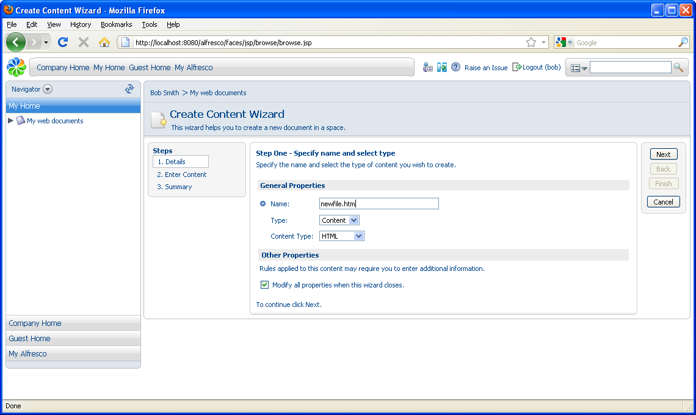
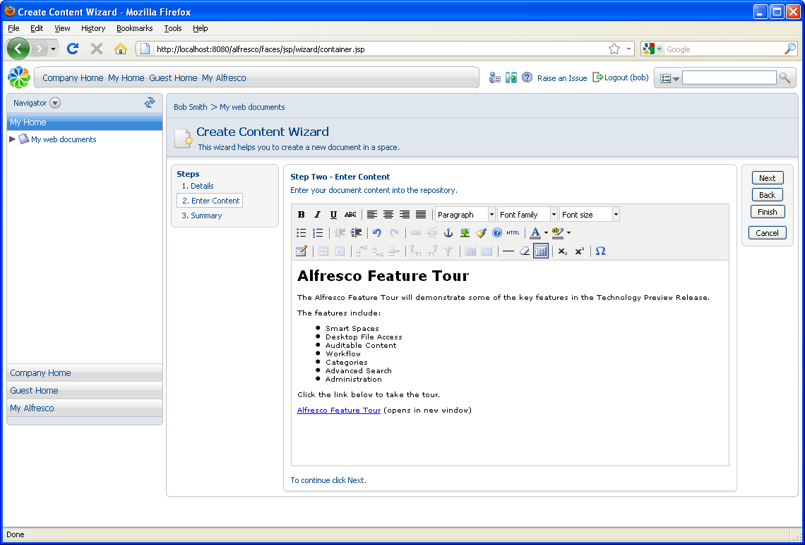
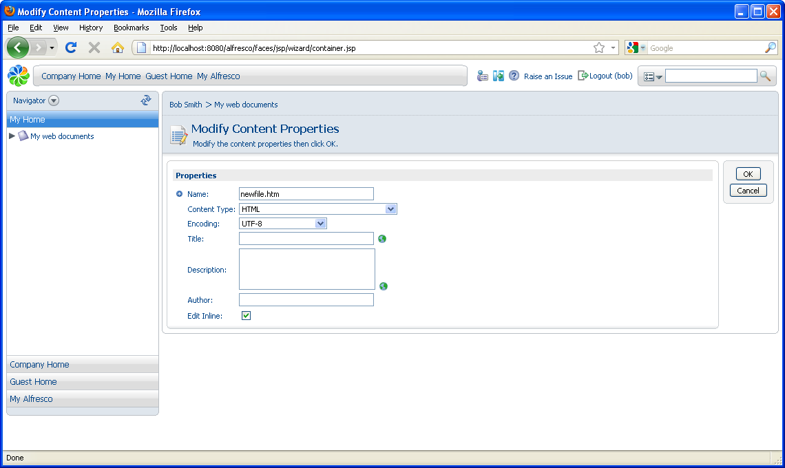
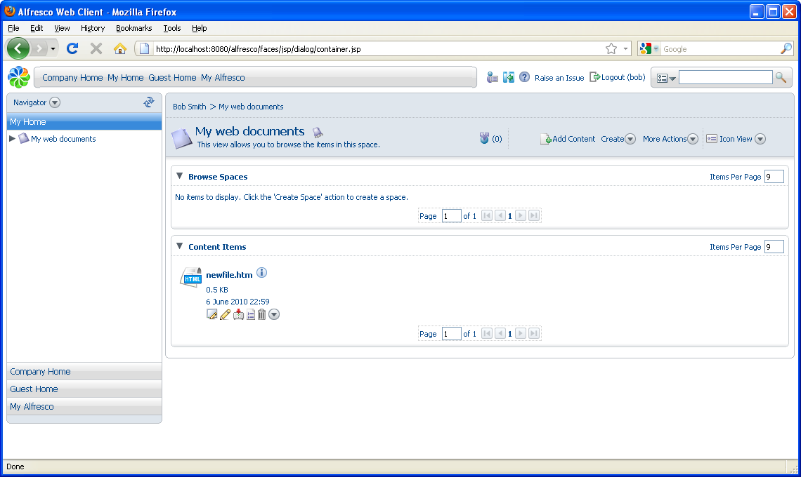

# Creating and editing content in a space

In this task, you will create content in a space using the Create Content Wizard.

1.  Open the **My web documents** space \(click the icon or the name\).

2.  In the **Create** menu, click **Create Content**.

    The Create Content Wizard starts.

3.  Type newfile.htm as the file name.

    **Note:** The remaining general properties are populated by default. You can modify them.

    

4.  Click **Next**.

5.  In Step Two - Enter Content, add the following example web page, including text formatting.

    

6.  Click **Next** to display the summary page.

7.  Click **Finish**.

    The **Finish** button becomes active when there is enough information to complete a task. Any additional steps are optional. The Modify Content Properties page displays the full set of properties for the document created.

    

8.  Review the properties and add new ones if you like. These properties vary for different Types and Smart Spaces.

9.  Click **OK** to save the properties and return to the My web documents space.

    **Note:** If there are any required properties, **OK** is not enabled until they have been completed.

    The new file is listed in the Content Items pane.

    

**Parent topic:**[Creating spaces and content](../tasks/tgs-create-spacecontent.md)

