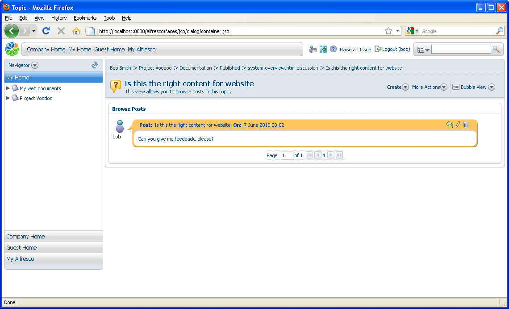

# Discussions

Discussions are like a forum attached to a piece of content. Wherever the document is moved, the discussion goes with it. They provide an ideal way to record decisions or annotations about a document without changing the content.

1.  Navigate to the content item **system-overview.html** \(now located in the **Published** space\).

2.  In the Content Items pane, click  for this item and select **Start Discussion**.

3.  On the Create Topic page, enter the discussion details and click **Create Topic**.

    

4.  To view a discussion on an item, click  **\(View Discussions\)** associated with the content item.

If you check out a document that has a discussion, the working draft will not have that discussion. However, if you start a discussion on a working copy when it is checked in, the discussion is added to the original item with a date stamp. While content is checked out, the original content is locked but discussions can still continue on it.

**Parent topic:**[Forums and discussions](../concepts/cgs-forumsdiscussions.md)

