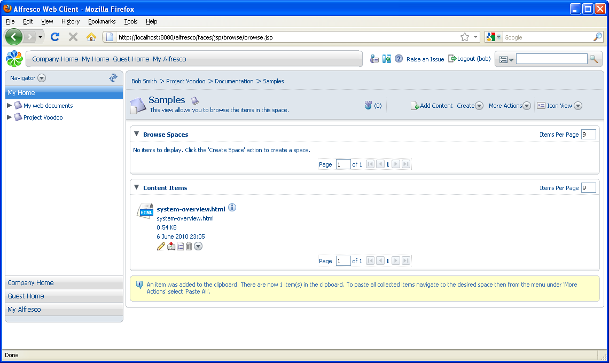

# Moving content using the clipboard

A sample software overview document is created as part of the template you are using. Use this document to test the rules.

1.  Navigate to the Samples space \(**Project Voodoo \> Documentation \> Samples**\).

2.  In the Content Items pane, click  for the item **system-overview.html** and select **Copy**. A message indicates that the document was successfully added to the clipboard.

    

3.  In the sidebar, click  and select **Shelf** to view the clipboard contents.

4.  Navigate to the Drafts space.

5.  In the **More Actions**menu, click **Paste All**. A new copy of the document **system-overview.hml** is pasted in the Drafts space and the contents of the clipboard are removed.

    If the content is cut, a reference to it is placed in the clipboard and the content remains in its original place until you paste it in the new location. The clipboard contents are not retained over login sessions, so if you cut some content and then log out, the content stays where it was originally located.

    You can also paste items as links, which creates an item that points to another space or content, but can have a different name and description.

6.  In the sidebar, display the Navigator again.

**Parent topic:**[Building smart spaces](../concepts/cgs-smartspace.md)

