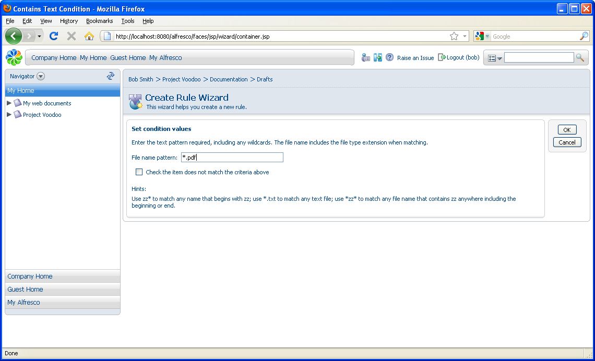
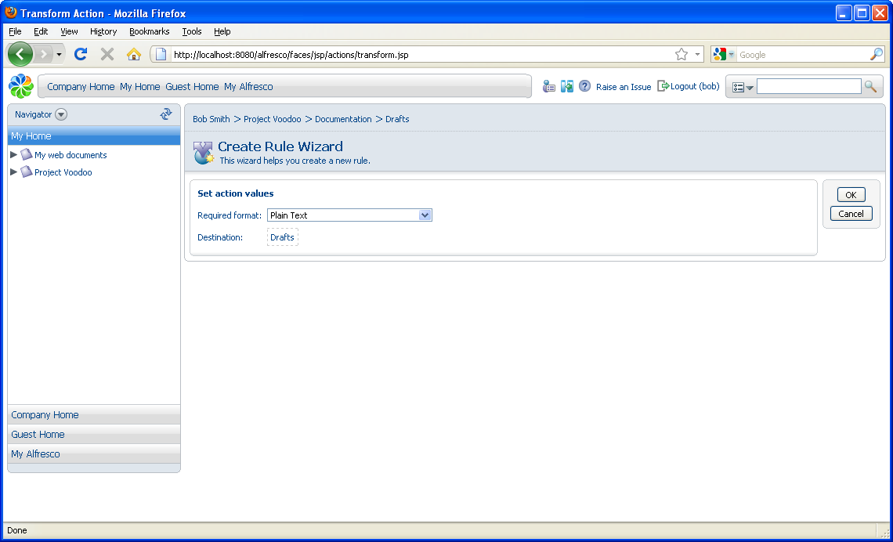
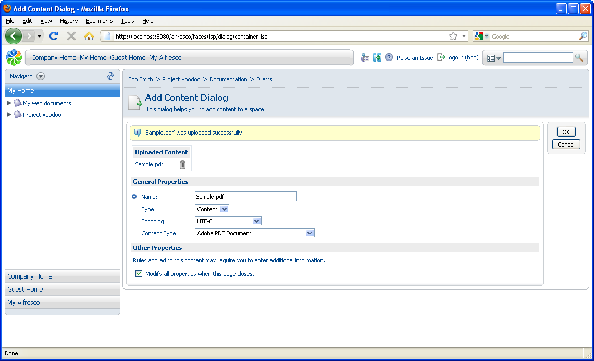
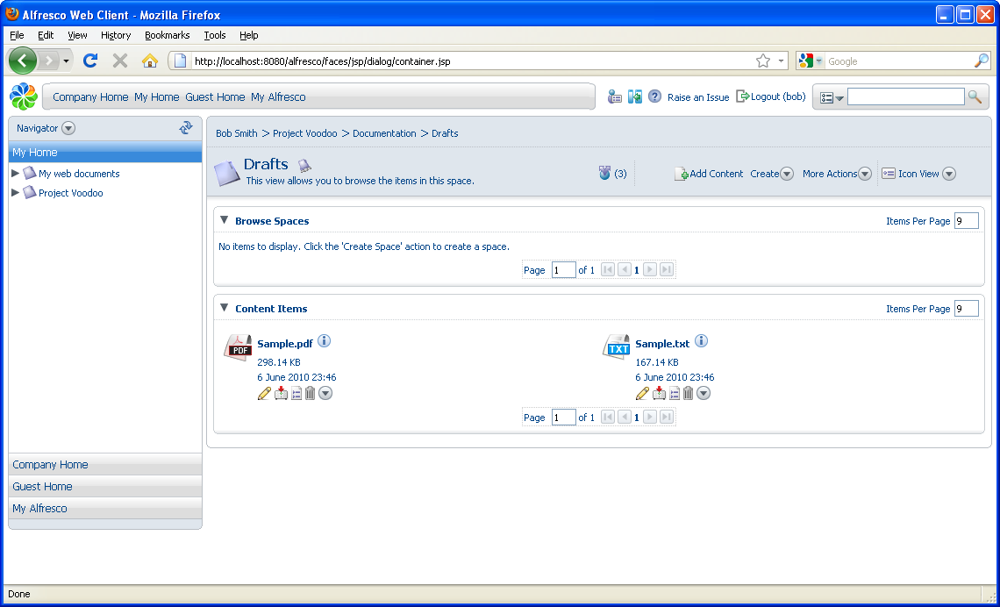

# Uploading and transforming content

Define a transformation rule that converts content as it is uploaded to a space.

In the following scenario, you want to use some marketing content in a technical document. However, the marketing content is in PDF format only. To use the text, define a transformation rule that converts content to a different format.

1.  Navigate to the Drafts space in Project Voodoo. From the **More Actions** menu, select **Manage Content Rules**.

2.  Click **Create Rule**.

3.  Complete Step One using the following information.

    1.  Select **Name contains value** as the **Condition**.

    2.  Type \*.pdf as the condition value.

        

4.  In Step Two, set the action as follows:

    1.  Select **Transform and copy content** as the **Action**.

    2.  Select **Plain Text** as the action value.

    3.  Select the **Drafts** space as the **Destination**.

        

5.  Enter the following details in Step Three:

    1.  Specify **Items are created or enter this folder** as the **Type**.

    2.  Type Transform PDFs as the **Title**.

6.  Click **Finish** to complete the wizard.

7.  Click **Close**.

    Now you can upload a file to exercise the rule.

8.  Click **Add Content** in the Drafts space header, then browse to and select any PDF file available on your computer.

    

9.  When the message confirming the upload displays, uncheck **Modify all properties when this page closes** and click **OK**. The Drafts space now contains two new documents: the PDF file and the text version of it.

    

**Parent topic:**[Getting Started with Alfresco Explorer Document Management](../concepts/cgs-intro.md)

