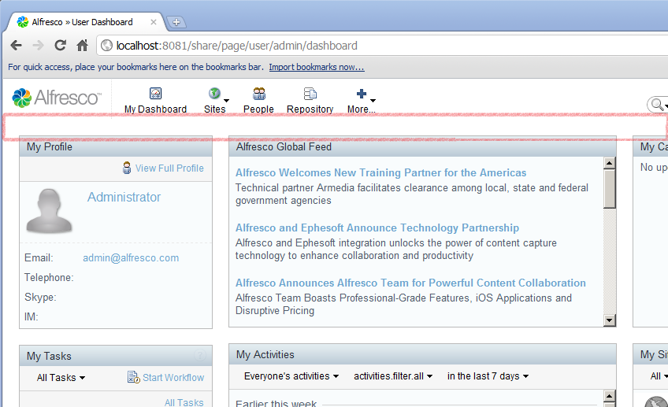

# 2. Control rendering of content on an Alfresco Share page

Building on the previous tutorial where you created and deployed an extension module that added extra content to a user dashboard page in Alfresco Share, this tutorial demonstrates how to use an extension module to prevent content being rendered in an Alfresco Share page. This tutorial also shows how to use evaluations to decide whether a component should be rendered or not.

The module in the previous tutorial added content to the titlebar on the user dashboard. This tutorial writes a module to hide the titlebar. As the same component is being targeted as in the previous tutorial, values for `region-id`, `source-id`, and `scope` properties can be reused, rather than having to obtain these values for the new target component using SurfBug.

1.  Add another `<module>` entry into the `<modules>` element as follows:

    ```
    
    
    <module>
    <id>Blog Module (Hide Title)</id>
        <components>
           <component>                     
              <region-id>title</region-id>                    
              <source-id>user/{userid}/dashboard</source-id>                     
              <scope>page</scope>                     
              <sub-components>                         
                 <sub-component id= "default" >
                    <evaluations>                                 
                      <evaluation id= "guaranteedToHide" >
                          <render> false </render>                                 
                      </evaluation>                             
                     </evaluations>                         
                   </sub-component>                     
               </sub-components>                 
              </component>         
             </components>     
    </module>
    
    
    ```

    Note that the `source-id` element uses a parameterized value. This will be discussed in more detail later in this tutorial.

2.  Complete the following steps \(they should be familiar from the previous tutorial\):

    1.  Rebuild your JAR file.

    2.  Copy your JAR file into the webapps/share/WEB-INF/lib directory.

    3.  Restart the server.

    4.  Open **http://localhost:8080/share/page/modules/deploy** in a web browser.

    5.  If you still have Blog Module \(New Content\) deployed, undeploy it by selecting it and clicking **Remove**.

    6.  Deploy **Blog Module \(Hide Title\)** by selecting it and clicking **Add**.

    7.  Click **Apply Changes** to save your module deployments.

    8.  Log in to Alfresco Share. You will see that the titlebar no longer displays.

        

        Some features introduced in this tutorial are explained in more detail in the following sections:

        **Parameterized source-id mapping**: Every Alfresco Share user gets their own dashboard page, which enables them to customize the layout to suit their own needs, but each user dashboard is generated from a single preset. In the previous tutorial, you targeted only the Admin user dashboard by extending the title region on the `user/admin/dashboard` template. In this tutorial you specify `user/{userid}/dashboard`. Note the use of the `user` variable. This allows you to change the appearance of the dashboard for any user, not just the admin user as was previously the case.

        **Extending existing Sub-Components:** When the dashboard pages were first created, the concept of Sub-Components in Spring Surf did not exist. Consequently, if you search through the existing dashboard configuration files you will not find Sub-Components specified. Spring Surf automatically converts these “legacy” Components into the new extensible Components containing a single Sub-Component with the ID “default”. These new extensible Components are called Advanced Components.

        This allows you to add new content to these legacy Components through Sub-Components, or customize the original content without affecting any new content. In the previous configuration XML, you can change the behaviour of the components through modification of the default Sub-Component.

        Note that multiple modules can extend the same Component, which is why the deployment order of modules is important.

        **Sub-Component evaluations:** Every Sub-Component can optionally have zero or more evaluations. Each evaluation acts like an AND gate to a series of evaluators where an evaluation is considered successful if no evaluators fail. If an evaluation contains no evaluators, it is still considered to have evaluated successfully because nothing has failed.

        The purpose of an evaluation is to change the behavior of a Sub-Component in one of three ways:

        -   Change the web script that renders the content by specifying a new URL.
        -   Change the default properties \(and/or provide new properties\) that are passed to the web script.
        -   Control whether or not the Sub-Component is actually rendered.
        In this example, you are simply overriding the default behavior of the Sub-Component to prevent it from rendering by setting the `<render>` element to have a value of false \(this defaults to `true`\) if not defined.

        **Module deployment:** It would have been possible to add the `<sub-component>` elements \(and its children\) into the module created in the previous tutorial, as a single module can update multiple Components and Sub-Components.  Adding the configuration to prevent rendering of the titlebar as a separate module allows you to deploy and undeploy both extension modules independently. If you deploy both modules, you will see that both modules are active, with the new content is still rendered despite the titlebar itself not being rendered.

        It is not necessary to restart the web server between module deployment changes. As long as you remember to click Apply Changes, the updates will show the next time you refresh the Alfresco Share page.


**Parent topic:**[Tutorials](../concepts/surf_share_v4-tutorials.md)

