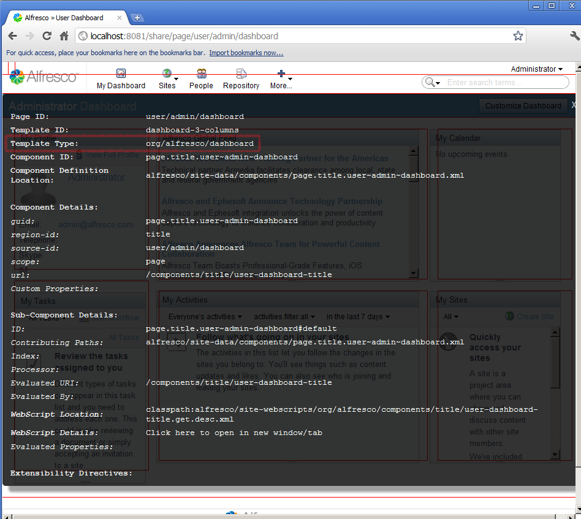
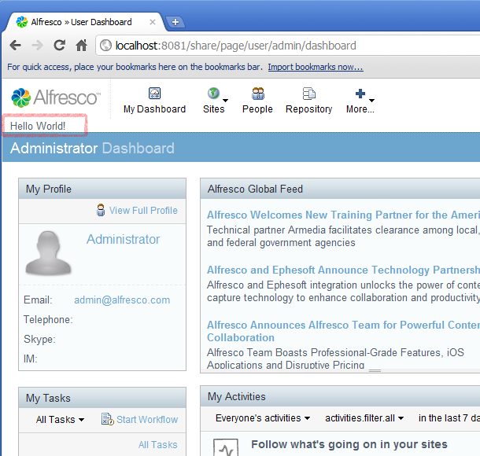

# 6. Customize Alfresco Share FreeMarker templates

In this tutorial you see how to add content to a page by using the `<@region>` directive extension.

You will need to identify the template file being used to display the page. Once this file has been identified using SurfBug, you can create customization that uses the `<@region>` directive to insert content, replace content or remove content.

1.  Enable **SurfBug** and click on the titlebar. Note the **Template Type** property, which in this case is **org/alfresco/dashboard**. This means that the file that you need to extend is dashboard.ftl in the org.alfresco package.

    

2.  Update the blog-demo.xml file to add the following module definition:

    ```
    
    
    <module>        
      <id>Blog Module  (Add Region) </id>        
      <customizations>            
        <customization>                
              <targetPackageRoot>org.alfresco</targetPackageRoot>                
              <sourcePackageRoot>blog.demo.customization</sourcePackageRoot>          
         </customization>       
        </customizations>   
    </module>
    
    
    ```

3.  Create a file called dashboard.ftl and place it in the package `alfresco.templates.blog.demo.customization`. The file should contain the following:

    ```
    <@region id="additional-content" target="title" action="before" scope="global" />             
    ```

    **Note:**

    The package you have added the file to is prefixed by `alfresco.templates`. This is the source package at which Spring Surf Class Loader starts looking for template files. It is critical to include this prefix to your package or your extension won’t be found.

    Next, you create a new Component to bind to your new Region. You will use the legacy configuration style \(although you could use the new style, this way is shorter and suitable for our purposes\).

4.  Create a file called **global.additional-content.xml** and place it in the **alfresco.site-data.components** package. The file should contain the following:

    ```
    
    
    <component>        
       <region-id>additional-content</region-id>        
       <source-id>global</source-id>        
       <scope>global</scope>        
       <uri>/blog/demo/new-content</uri>   
    </component>
    
    
    ```

    **Note:** You are reusing the same web script created in the [Add Content to an Alfresco Share Page](tu_40_add-content.md) tutorial. If you have not completed that tutorial, then the Component will not find the web script specified by the `<uri>` element.

5.  Rebuild and redeploy the JAR, and restart the Alfresco Share web server to see the additional content.

    

6.  If you want to test out the other customization operations, you can update the dashboard.ftl file as follows:

    -   To place the new content *after* the titlebar:`<@region id="additional-content" target="title" action="after" scope="global"/>`
    -   To *replace* the content of the titlebar with the new content:`<@region id= "additional-content" target= "title" action= "replace" scope= "global"/>`
    -   To *remove* the titlebar region completely:`<@region id="additional-content" target="title" action="remove"/>`

-   **[About FreeMarker extensibility directives](../concepts/share-FM-models-about.md)**  
Extensibility directives provide a way of dynamically editing HTML through configuration.

**Parent topic:**[Tutorials](../concepts/surf_share_v4-tutorials.md)

