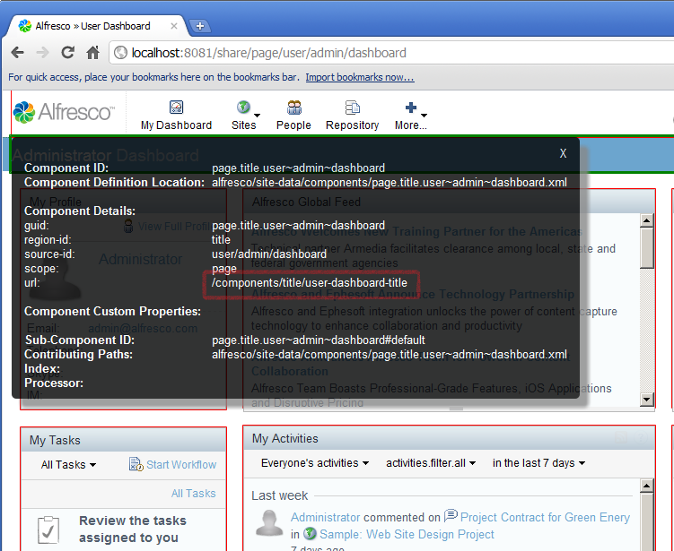
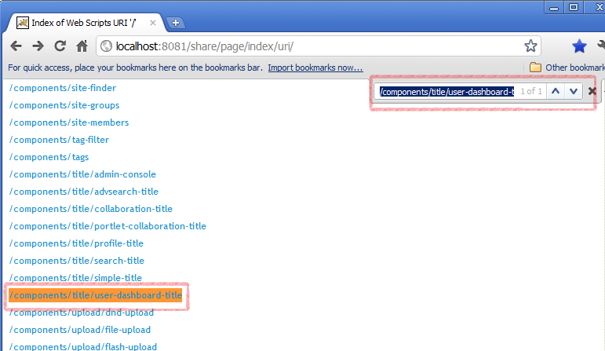
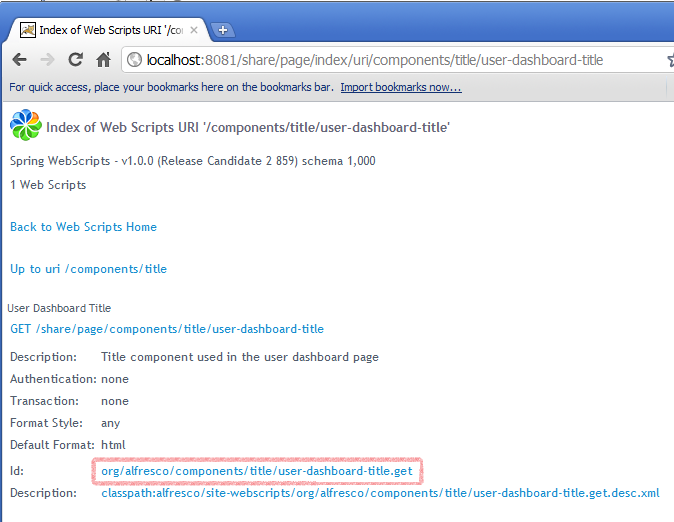
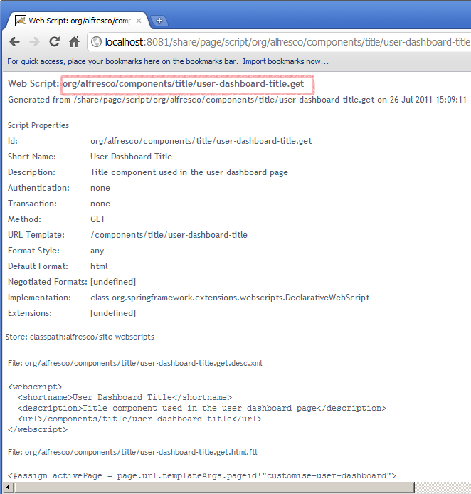
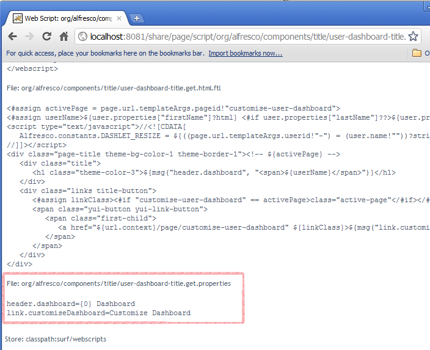
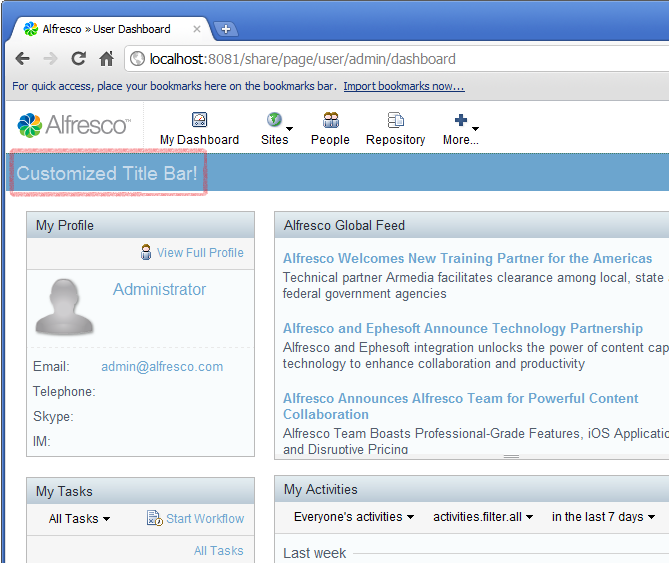

# 4. Customize Alfresco Share i18n properties

Previous tutorials described how to customize Alfresco Share through the use of Component extensions. This tutorial starts describing the changes Alfresco has made to Spring Surf to further simplify customization use cases, starting with demonstrating how to customize web script i18n properties.

You will learn how to override the default i18n properties for the User Dashboard titlebar. This tutorial shows how to use the SurfBug and the Web Scripts UI to find the web scripts that need to be targeted, and demonstrates how to create the necessary extension module configuration and files to achieve the customization.

1.  Log in to Alfresco Share and navigate to the user dashboard.

2.  Open a new browser window or tab and enable **SurfBug**, [http://localhost:8080/share/page/surfBugStatus](http://localhost:8080/share/page/surfBugStatus) – if you are using default port settings on your local machine.

3.  Refresh the dashboard page and click the title to see the information about the Component/Sub-Component that is rendering it.

4.  Confirm the `url` value in the Component details section. The value will be `/components/title/user-dashboard-title`.

    

5.  Open a new browser window or tab at the Web Scripts Home page `http://localhost:8080/share/service/index` and click **Browse by Web Script URI**.

6.  Find and click **/components/title/user-dashboard-title** to see the information about the web script that is rendering the titlebar.

    

7.  Click the link next to Id to see all the information about the web script.

    

8.  Identify the package that the web script belongs in `org.alfresco.components.title` because you will be customizing the code defined in that package.

    

9.  Edit your `blog-demo.xml` file created in a previous tutorial, and add the following module definition:

    ```
    
    
    <module>        
      <id>Blog Module (i18n property change)</id>        
      <customizations>            
        <customization>                
          <targetPackageRoot>org.alfresco.components.title</targetPackageRoot>                
          <sourcePackageRoot>blog.demo.customization</sourcePackageRoot>            
         </customization>       
        </customizations>   
    </module>           
    
    
    ```

10. On the page showing the information about the web script, scroll down to find the section on the i18n properties file that will show both the fully qualified name of the file with its contents.

    

11. Create a new file called `user-dashboard-title.get_en.properties` and place it in package `webscripts.blog.demo.customization` package that we defined as the `sourcePackageRoot` element in the module configuration. The file should contain the following:

    ```
    header.dashboard=Customized Title Bar\!
    ```

    Important points to note:

    -   The file name for the newly created properties file is not the same as that taken from the script information page. The web script information file was `org/alfresco/components/title/user-dashboard-title.get.properties` and the newly created file is called `user-dashboard-title.get_en.properties`. Although a web script will broaden the locale of its search, for example from “en\_GB” to “en” to the default properties file, extensions do not.
    -   The source package has been prefixed with `webscripts.`. This is a requirement of the class loader used to find web script files.
12. Rebuild the JAR, copy it to `webapps/share/WEB-INF/lib` \(or the equivalent directory for your web server\), restart the web server, and deploy the new module.

13. Log in to Alfresco Share where you will now see that the titlebar says “Customized Title Bar!”.

    


**Parent topic:**[Tutorials](../concepts/surf_share_v4-tutorials.md)

