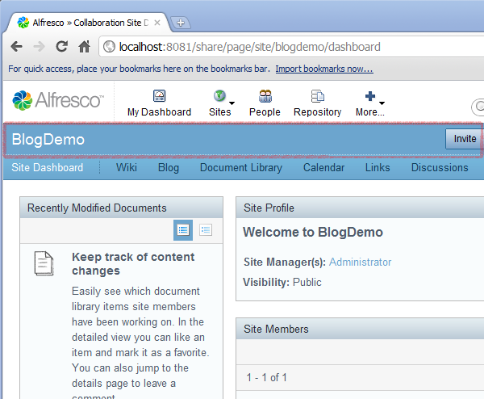
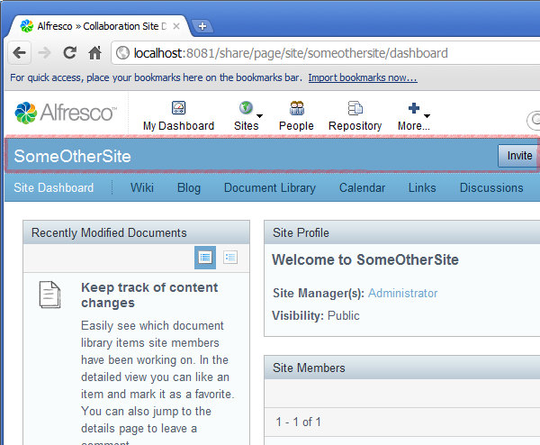
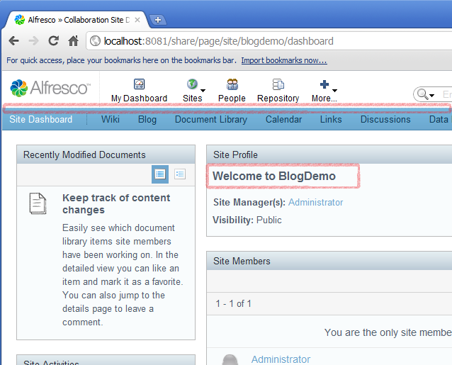
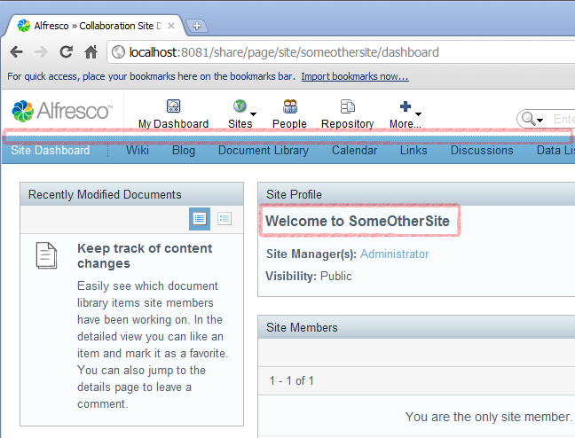

# 3. Sub-Component Evaluations

In the previous tutorial, you extended a Component and prevented its default Sub-Component from being rendered through the use of an Evaluation. This tutorial delves further into Evaluations and introduces Evaluators, demonstrating how they are defined and used.

This tutorial creates a similar module to the last one – but instead of not rendering the titlebar on the user dashboard, this will not render the titlebar on the site dashboard, but only if the site has a specific name.

1.  Add the following module definition to the file blog-demo.xml:

    ```
    
                                
    <id>Blog Module  (Conditionally Hide Title) </id>
        <components>
           <component>                                        
              <scope>page</scope> 
               <region-id>title</region-id>                
               <source-id>site/{site}/dashboard</source-id>                       
              <sub-components>                         
                 <sub-component id= "default" >
                    <evaluations>                                 
                      <evaluation id= "HideIfBlogDemoSite" >
                        <evaluators>    
                             <evaluator type= "blog.demo.evaluator" ></evaluator>                                
                         </evaluators>  
                          <render> false </render>                                 
                      </evaluation>                             
                     </evaluations>                         
                   </sub-component>                     
               </sub-components>                 
              </component>         
             </components>
             
    
    ```

    Site dashboards are similar to user dashboards in that a new configuration is created from a preset for each new site. This means you need to target your Component using the `site` parameter.

    The Evaluator `type` attribute must map to a Spring bean id defined in the application context. Therefore, you need to create this Evaluator and define it as a Spring bean.

2.  First create the following class:

    ```
    
    
    package blog.demo;     
    import java.util.Map;     
    import org.springframework.extensions.surf.RequestContext;   
    import org.springframework.extensions.surf.extensibility.impl.
      DefaultSubComponentEvaluator;     
    
    public class BlogDemoEvaluator  extends DefaultSubComponentEvaluator   
    {        
         public boolean evaluate(RequestContext context, Map<String, String> params)        
         {            
                boolean result;            
                String site = context.getUriTokens().get( "site" );            
                if (site ==  null )            
                {                
                    site = context.getParameter( "site" );            
                 }            
                 result = (site !=  null && site.equals( "blogdemo" ));            
                 return result;        
         }   
    }       
    
    
    ```

    The Spring bean compares the site name with the hard-coded string “blogdemo”. The returned result will be `true` if the site name matches the hard-coded string, causing the evaluator to be true, thus preventing rendering of the titlebar component.

3.  Create a new file called spring-surf-extensibility-context.xml and place it in a new org.springframework.extensions.surf package in your JAR file. Any file that fits the pattern **org.springframework.extensions.surf.-context\*** will get processed so that it will be included in the application context. Ensure this file contains the following:

    ```
    
    
    <?xml version= '1.0' encoding= 'UTF-8' ?>   
    <beans xmlns= "<xref href="http://www.springframework.org/schema/beans" scope="external" format="HTML">http://www.springframework.org/schema/beans"</xref>                  
          xmlns:xsi= "<xref href="http://www.w3.org/2001/XMLSchema-instance" scope="external" format="HTML">http://www.w3.org/2001/XMLSchema-instance"</xref>                  
          xsi:schemaLocation="http: //www.springframework.org/schema/beans                                      
                              http: //www.springframework.org/schema/beans/spring-beans-2.5.xsd">          
       <bean id= "blog.demo.evaluator" class="blog.demo.BlogDemoEvaluator"/>   
    </beans>    
    
                            
    ```

    This configuration file maps the Java class to the Spring bean id.

4.  Build and deploy your JAR to Alfresco Share as described in the previous tutorials, then restart the web server.

5.  Log in to Alfresco Share and create two new sites: **BlogDemo** and **SomeOtherSite**. As the new module has not yet been deployed, you will see the titlebar on both sites.

     

6.  Now go to the Module Deployment WebScript **http://localhost:8080/share/page/modules/deploy**. This URL assumes you are running the server locally and using the default port. Deploy the new module, as described in previous tutorials. When you refresh the dashboard pages for the *BlogDemo* and *SomeOtherSite* sites, you will see that the titlebar is displayed on the latter, but not the former.

    

    Evaluators can also accept parameters so that they can be easily reused. This is illustrated in the following steps.

7.  Update the blog-demo.xml file so that the Evaluator is configured as follows:

    ```
    
                                
    <evaluator type= "blog.demo.evaluator" >      
       <params>            
         <site>someothersite</site>        
       </params>   
    </evaluator>   
    
    
    ```

8.  Modify the `BlogDemoEvaluator` class `evaluate` method so that it looks like this:

    ```
    
                     
    public boolean evaluate(RequestContext context, Map<String, String> params)   
    {        
        boolean result;        
        String site = context.getUriTokens().get( "site" );        
        if (site ==  null )        
        {            
           site = context.getParameter( "site" );        
         }          
         String targetSite = params.get( "site" );        
         result = (site !=  null && site.equals(targetSite));        
         return result;   
    }     
    
    
    ```

9.  Rebuild and redeploy the JAR, then restart the web server. You will now see that the **SomeOtherSite** titlebar is hidden and the **BlogDemo** titlebar is displayed.

    

    When setting Evaluator parameters, the element name is the parameter key and the element value is the parameter value. All the configured parameters will be passed as the `params` argument when the `evaluate` method is called. Parameters can also accept token substitution – so you could set a parameter of:

    ```
    <site>{site}</site>
    ```

    This would pass in whatever the name of the site was. This would cause the Evaluator to pass, regardless of the site dashboard being displayed.


**Parent topic:**[Tutorials](../concepts/surf_share_v4-tutorials.md)

