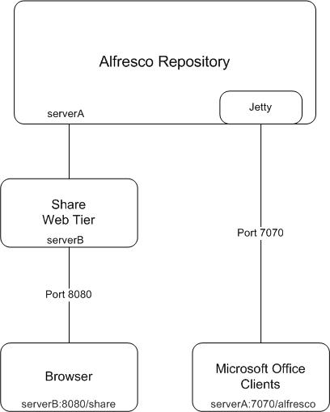

# Installing and configuring Microsoft Office SharePoint Protocol Support

The Microsoft Office SharePoint Protocol Support offers Microsoft users greater choice by providing a fully-compatible SharePoint repository that allows the Microsoft Office Suite applications \(for example, Word, PowerPoint, Excel\) to interact with Alfresco as if it was SharePoint.

This enables your users to leverage the Alfresco repository directly from Microsoft Office.

You can also use Microsoft Office SharePoint Protocol Support to enable online editing for Office documents within Alfresco Share. It enables your users to modify Office files without checking them in and out. Alfresco locks the file while it is being modified and releases the lock when the file is saved and closed.

The following diagram shows the architecture of the SharePoint Protocol Support in relation to an Alfresco installation.

**Note:** Microsoft Office 2010 onwards doesn't include a Document Management panel for working with the Alfresco repository from Microsoft Office, but you can still use the online editing feature in Alfresco. You can reopen documents stored in Alfresco by clicking **File** then **Recent** in a Microsoft Office program and selecting the document.

The SharePoint Protocol Support architecture embeds a Jetty web server within the Alfresco repository. The Microsoft Office clients communicate directly with the Jetty server using WebDAV-like calls with proprietary extensions and on different port number from Alfresco Share. This port number can be configured in the SharePoint Protocol Support properties files.

-   **[Installing the SharePoint Protocol Support AMP](../tasks/SharePoint-install.md)**  
The SharePoint Protocol support functionality is installed from an Alfresco AMP. If you use the Windows or Linux installers to install Alfresco, the SharePoint Protocol Support is installed by default. These instructions describe how to install the SharePoint Protocol Support into the Alfresco WAR.
-   **[Prerequisites for using SharePoint Protocol](../concepts/SharePoint-reqs.md)**  
The SharePoint Protocol module lets you manage Alfresco content from within Microsoft Office. To use SharePoint with Alfresco from an Microsoft Windows Client machine, you need to install an essential update from Microsoft. This update is applicable to certain Windows operating systems only.
-   **[Configuring SharePoint Protocol Support](../tasks/SharePoint-config.md)**  
This information describes how to configure the SharePoint Protocol Support properties to complete the set up process.
-   **[Configuring SharePoint Protocol for Online Editing](../concepts/SharePoint-onlineedit.md)**  
The following issues are known for configuring the SharePoint Protocol for Online Editing.
-   **[Setting up SharePoint Protocol Support to work with Office](../tasks/SharePoint-config-office2010.md)**  
Alfresco supports Office 2010/2013 clients, Office 2007/2010 on Windows 7, Microsoft Office for Mac 2011, and Office for Mac 14.3.1. You can enable basic authentication over a non-SSL connection on Windows 7/Windows Vista clients using Office 2010/2013 for the SharePoint Protocol.
-   **[Setting up sticky sessions with SharePoint Protocol Support](../tasks/cluster-SPP-stickysession.md)**  
This section describes how to configure sticky sessions in a high availability environment with the SharePoint Protocol Support embedded Jetty server.
-   **[Configuring SharePoint Protocol with SSL](../tasks/SharePoint-SSL.md)**  
You can configure the Alfresco `vti` module to allow SharePoint Protocol support over SSL.

**Parent topic:**[Installing](../concepts/master-ch-install.md)

