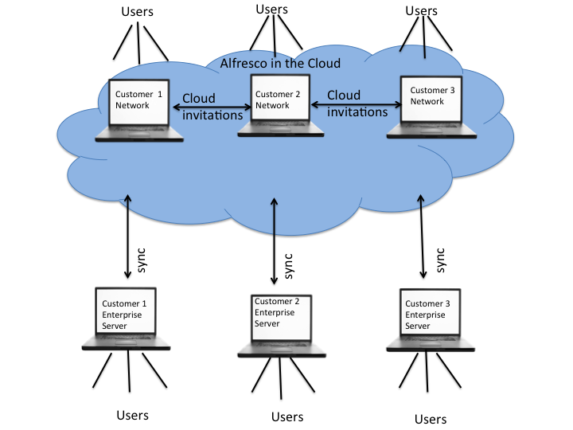

# Enterprise to Cloud Sync overview

The Enterprise to Cloud Sync feature allows Alfresco Enterprise users to synchronize content between their local on-premise Alfresco and a network on the cloud.

This gives other Alfresco in the cloud users access to the content within the same network. Alfresco in the cloud users can also send invitations to other cloud users to join their network and share the synchronized content.

The following diagram shows the synchronization flow for the Enterprise to Cloud Sync feature.

-   **[Supported Use Cases for Enterprise to Cloud Sync](../concepts/cloud-sync-supported-use-cases.md)**  
Enterprise to Cloud Sync enables simple synchronization of content between an on-premise repository and an associated network in Alfresco in the cloud \(hosted at https://my.alfresco.com\). In this way, selected content can be shared across corporate firewalls so that it can be accessed by users external to an organization, and teams can collaborate across corporate boundaries without giving external users access to internal systems. After the need for collaboration has passed, the synchronization can be deleted and the content will be removed from Alfresco in the cloud but will remain archived in the on-premise repository.

**Parent topic:**[Setting up Enterprise to Cloud Sync](../concepts/cloud-sync-intro.md)

