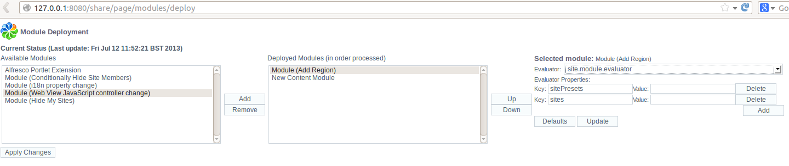

# Module deployment and evaluators

This topic describes how Share Extensibility Modules are deployed, and how their behavior can be changed using evaluators.

Share Extensibility Modules can be deployed using the facility provided at `http://localhost:8080/share/page/modules/deploy`.

CAUTION:

While there is a Module Deployment link available at `http://localhost:8080/alfresco` it will not work, as Module Deployment can only occur in the Share context, not the repository context.

Available modules are listed and can be deployed by selecting the module, clicking **Add**, and then clicking **Apply Changes**.

Once a deployed module is selected, an Evaluator can be selected, and its properties set, using the same interface, as shown in the following screenshot:

The mechanism shown allows the default module operation to be overridden.

The functionality of a deployed module may not be applicable to every request, so it is possible to associate an evaluator with a module. The evaluator runs to evaluate whether or not the request is applicable to the module. Spring Surf will automatically apply the default evaluator on each request. When you deploy the module you have the option of using the default evaluator, or selecting another, which may be a custom written evaluator.

The default module evaluator is configured in the Spring application context with the `id` `default.extensibility.evaluator`. This maps to the class `org.springframework.extensions.surf.extensibility.impl.ApproveAllModulesEvaluator` which will always evaluate to true.

Another evaluator available as standard has the bean `id` of `config.approval.evaluator`. If you select this as the evaluator when deploying a module you will see that it asks for a single property with the key `apply` which determines whether or not the target module gets applied. If you set the value of `apply` to `true` then the module will always be applied, if you set it to anything else then the Module will never be applied.

**Attention:** If you make changes to the evaluator and its properties on the Module Deployment page in Share, it is importnat to click Update to update the module configuration and then Apply Changes to persist these changes.

**Parent topic:**[Share extensions](../concepts/dev-extensions-share.md)

