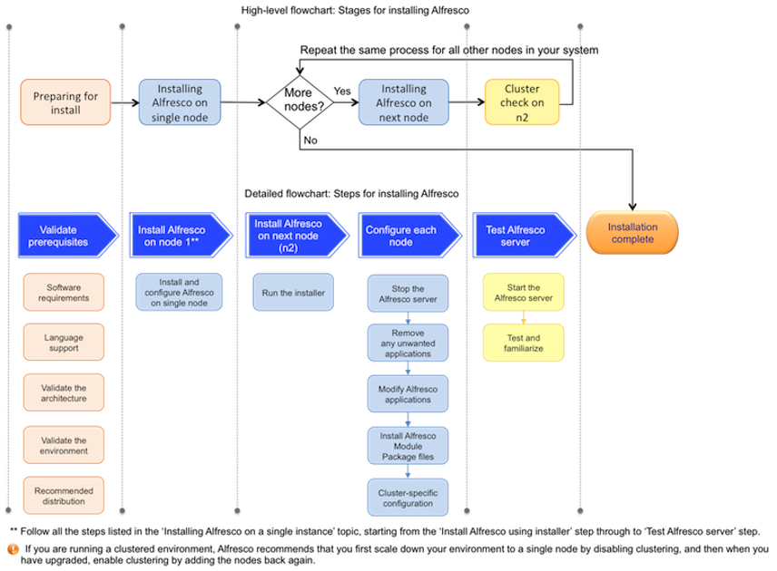

# Installing Alfresco in a distributed environment

This topic describes the steps for installing Alfresco in a distributed environment.

The main stages involved in installing Alfresco in a cluster are shown in the *High-level flowchart* below. You must install and configure your data on a single node first and then on the second node, and so on.

The main steps involved in the installing process include preparing your system for installation, [installing Alfresco on a single node](install-singleinstance.md), installing Alfresco on node 2, and finally, testing and getting familiar to Alfresco. Repeat the last two steps on all the other nodes in your system in series.

Each of these main stages consist of sub-steps, as shown in the *Detailed flowchart* below. The *Detailed flowchart* displays the sub-steps that need to be performed in order to complete each main stage.

**Note:** Note that the steps shown in the *High-level flowchart* have a colour code, which corresponds to the same colour coded steps in the *Detailed flowchart*. For example, Preparing for install stage consists of four sub-steps, namely, Software requirements, Language support, Validate the architecture, Validate the environment, and Recommended distribution.

**Note:** Make sure you do not install and configure all the nodes in parallel. Follow in the installation process in series for all the nodes in your system.

To get started quickly with installing Alfresco in a distributed environment, follow the process shown below.

Click on each task to learn more about it.

-   **[Cluster-specific configuration](../concepts/cluster-requirement.md)**  
If you have a distributed environment and want to implement clustering in Alfresco to improve the availability and performance of various services, you should enable clustering. This section describes the cluster-specific configurations for Alfresco.

**Parent topic:**[QuickStart installing guide](../concepts/quick-install.md)

