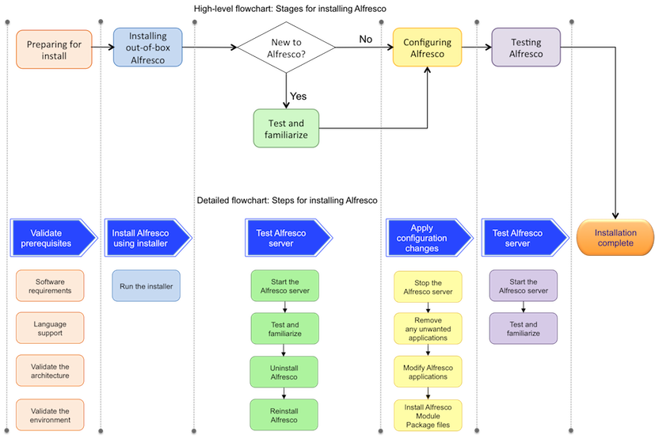

# Installing Alfresco on a single instance

This topic describes the steps for installing a single-instance of Alfresco.

The main stages involved in setting up and configuring Alfresco are shown in the *High-level flowchart* below. These include preparing your system for installation, installing Alfresco as an out-of-box application, configuring it based on your requirements, and finally, testing and getting familiar to Alfresco.

Each of these main stages consist of sub-steps, as shown in the *Detailed flowchart* below. The *Detailed flowchart* displays the sub-steps that need to be performed in order to complete each main stage.

**Note:** Note that the steps shown in the *High-level flowchart* have a colour code, which corresponds to the same colour coded steps in the *Detailed flowchart*. For example, Preparing for install stage consists of four sub-steps, namely, Software requirements, Language support, Validate the architecture, and Validate the environment.

To get started quickly with installing a single-instance of Alfresco, follow the process shown below. Click on each step to learn more about it.

**Parent topic:**[QuickStart installing guide](../concepts/quick-install.md)

