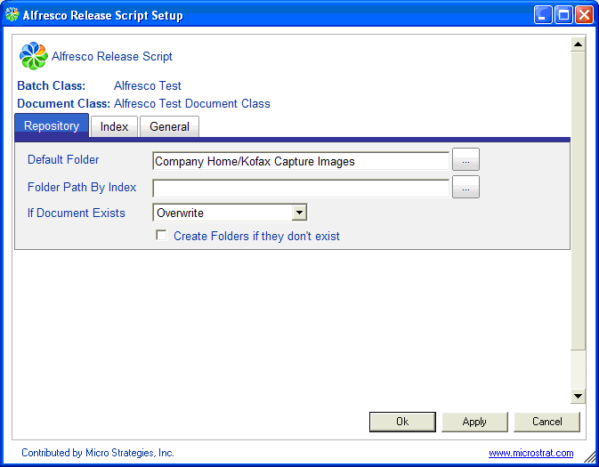

# Repository tab

The Repository tab is used to configure where documents are stored in the Alfresco repository and how existing documents are handled.



The Repository tab has the following options:

-   ****Default Folder****

    Defines the root Alfresco space in which documents will be created.

    **Note:** The user that connects to Alfresco must have permission to create documents in this space.

-   ****Folder Path by Index****

    Allows the folder path to be dynamically generated based on indexing values. Substitute Alfresco property name\(s\) to be used as part of the folder path.

    For example, the following will store all documents with the same `Invoice Date` property in folders according to the invoice date:

    ```
    Company Home/Invoices/[Invoice Date]
    ```

-   **If Document Exists**

    A document already exists if a document of the same name already exists in the folder in which the document is being released. The following defines how the Release script will handle existing documents.

    -   **Overwrite**: Replaces the document with the one being currently released.
    -   **Version**: Creates a new version of the document.
    -   **Release To Default Folder**: If the folder path specified in the **Folder Path By Index** field has an existing document with the same name, the document will be put into the location specified in the **Default Folder** field.
    -   **Throw Error**: The release fails with the error Duplicate child name not allowed.
    -   **Create Folders if they don’t exist**: If selected, this will automatically create folders that do not exist as defined by the previous **Folder Path by Index** settings. If this is not selected, and the folder path\(s\) do not exist, an error will occur and the document will fail.

**Parent topic:**[Alfresco Kofax Release script configuration tabs](../concepts/kofax-relscript-config.md)

