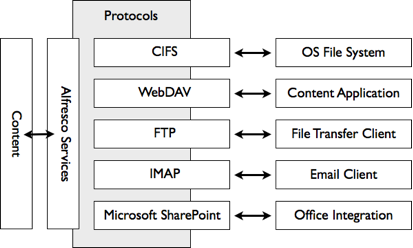

# Protocols

The Alfresco content application server supports many folder and document-based protocols to access and manage content held within the content repository using familiar client tools.

All the protocol bindings expose folders and documents held in the Alfresco content repository. This means a client tool accessing the repository using the protocol can navigate through folders, examine properties, and read content. Most protocols also permit updates, allowing a client tool to modify the folder structure, create and update documents, and write content. Some protocols also allow interaction with capabilities such as version histories, search, and tasks.

Internally, the protocol bindings interact with the content repository services, which encapsulate the behavior of working with folders and files. This ensures a consistent view and update approach across all client tools interacting with the Alfresco content application server.

An Alfresco subsystem for file servers allows configuration and lifecycle management for each of the protocols either through property files or JMX.

Supported protocols include:

-   **CIFS \(Common Internet File System\)**

    CIFS allows the projection of Alfresco as a native shared file drive. Any client that can read and write to file drives can read and write to Alfresco, allowing the commonly used shared file drive to be replaced with an ECM system without users even knowing.

-   **WebDAV \(Web-based Distributed Authoring and Versioning\)**

    WebDAV provides a set of extensions to HTTP for managing files collaboratively on web servers. It has strong support for authoring scenarios such as locking, metadata, and versioning. Many content production tools, such as the Microsoft Office suite, support WebDAV. Additionally, there are tools for mounting a WebDAV server as a network drive.

-   **FTP \(File Transfer Protocol\)**

    FTP is a standard network protocol for exchanging and manipulating files over a network. This protocol is particularly useful for bulk loading folders and files into the Alfresco content repository.

-   **IMAP \(Internet Message Access Protocol\)**

    IMAP is a prevalent standard for allowing email access on a remote mail server. Alfresco presents itself as a mail server, allowing clients such as Microsoft Outlook, AppleMail, and Thunderbird to connect to and interact with folders and files held within the Alfresco content repository. IMAP supports three modes of operation:

    1.  Archive: allows email storage in the Alfresco content repository by using drag/drop and copy/paste from the IMAP client
    2.  Virtual: folders and files held in the Alfresco content repository are exposed as emails within the IMAP client with the ability to view metadata and trigger actions using links embedded in the email body
    3.  Mixed: a combination of the above

-   **Microsoft SharePoint Protocol**

    Microsoft SharePoint protocol enables Alfresco to act as a SharePoint server, creating tight integration with the Microsoft Office suite. This allows a user who is familiar with the Microsoft task pane to view and act upon documents held within the Alfresco content repository. The collaborative features of Microsoft SharePoint, such as Shared Workspace, are all mapped to Alfresco Share site capabilities.

**Parent topic:**[Alfresco architecture](../concepts/alfresco-arch-about.md)

