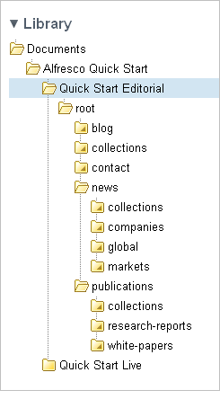

# Becoming familiar with the content

Before proceeding with the Web Quick Start tasks, it is important to take some time to understand the Quick Start terminology and the structure of the website content as it exists in Share.

The Quick Start demo site in Share is separated into two main folders: **Quick Start Editorial** and **Quick Start Live**. This folder structure provides a separation between the content that is being authored by the editorial team and the finished, reviewed, and published content that is visible on the live website.

**Note:** The default configuration assumes that you are running the Web Quick Start demo on your local machine. If this is not the case, then you must change the host name and port for the website in order to view it. The folders **Quick Start Editorial** and **Quick Start Live** hold the configuration for the editorial and live versions of the website respectively.

All content is delivered dynamically, meaning that any changes to the content update immediately. However, the Web Quick Start web application is configured with a default section cache time of one \(1\) minute, so changes to a section configuration—such as the section title, description, or template mapping—may take up to one minute to display on the website. If changes are not immediately visible on the website after such an edit, wait a short time and then refresh the page.

Within the **Alfresco Quick Start** folder hierarchy, all folders—those existing and any new ones created—are specialized to be of the type `ws:section`. As such, each folder \(such as **root**, **blog**, **contact**, **news**, and **publications**\) represents a different section of the Quick Start website—with the exception of the **collections** folders.

The **root** section corresponds to the Home page of the Quick Start demo website. Beneath this, the **blog**, **contact**, **news**, and **publications** sections correspond to the navigation links of the same names in the website header. Both the **news** and **publications** sections contain subsections, which appear as sub-menu items in the website header.

In the Share site, every section includes an **index.html** file and a **collections** subfolder. The **index.html** file is the asset used by the section’s landing page. The **collections** folder is used to manage asset collections for that section. The **index.html** file and **collections** folder are created automatically when you create a new folder.

An asset collection is simply a collection of content assets, referred to as web assets, grouped as the content editor sees fit. As an example, refer to the folder **Quick Start Editorial \> root \> collections**, which contains the following four asset collections for the Home page:

-   **blogs.latest**

    A dynamic asset collection that populates the Latest Blog Articles region of the web page

-   **featured.links**

    A static asset collection that populates the Featured region of the web page

-   **news.featured**

    A static asset collection that populates the carousel at the top of the web page

-   **news.top**

    A static asset collection that populates the News and Analysis region of the web page

A static asset collection allows you to manually select specific assets to be displayed within a given region of the website. Static asset collections provide fine grained editorial control. A dynamic asset collection allows you to automatically select website assets for display. Dynamic asset collections execute a query on a scheduled basis \(for example, select the three most recent blog articles and then repeat this query every five minutes\). These two types of asset collections provide the editorial team with a flexible method for keeping the website content both accurate and current.

An asset collection is considered to be dynamic if it has a query specified on it. An asset collection with no query specified is implicitly a static asset collection.

**Parent topic:**[Using Alfresco Web Quick Start](../concepts/qs-intro.md)

