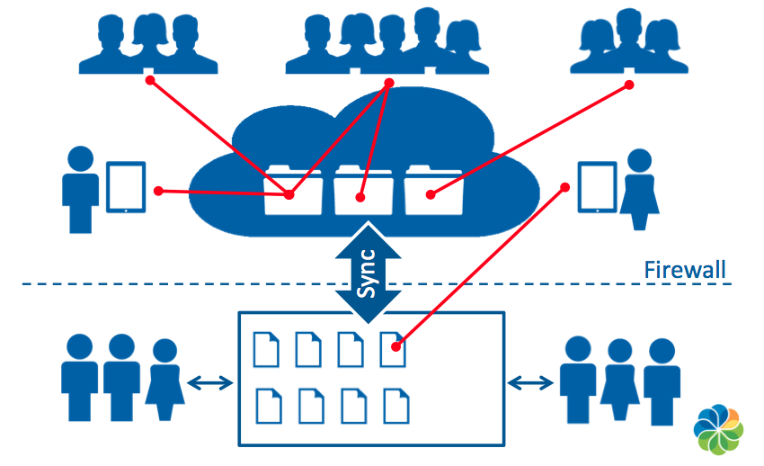

# Alfresco One overview

Alfresco One is an Enterprise Content Management \(ECM\) platform with hybrid, on-premise, cloud, and mobile delivery options. As a hybrid ECM solution, it combines the efficiency, collaboration, and control of an ECM platform with the agility and flexibility of the cloud. 

With Alfresco One, document management, collaboration, and process automation can be synced to the cloud, avoiding the risks associated with uncontrolled consumer file sharing and enabling secure collaboration outside of the firewall.

Alfresco is an enterprise content platform that you can use in the cloud or behind your firewall. It helps you store and share the documents that every business depends on.

The Alfresco content platform allows you to manage any type of content: from simple office documents, to scanned images, photographs, and even large video files. The built-in workflow feature allows companies to automate document intensive business processes, saving time and money. The native collaboration features enable secure collaboration, inside or even outside the firewall.

-   **[Alfresco applications](../concepts/apps-about.md)**  
Alfresco applications are built on the content application server and rely on the server to access, query, persist, and manage content.
-   **[Content applications](../concepts/apps-content-about.md)**  
 Alfresco can be used for building most ECM applications. Aside from the major applications such as document, image, records, digital asset, and web content management, there are a number of specific applications and use cases that add value to the enterprise.
-   **[Alfresco architecture](../concepts/alfresco-arch-about.md)**  
At the core of the Alfresco system is a repository supported by a server that persists content, metadata, associations, and full text indexes. Programming interfaces support multiple languages and protocols upon which developers can create custom applications and solutions. Out-of-the-box applications provide standard solutions such as document management, records managementand web content management.

**Parent topic:**[Alfresco One](../concepts/welcome-infocenter.md)

