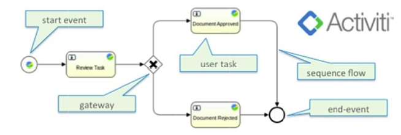
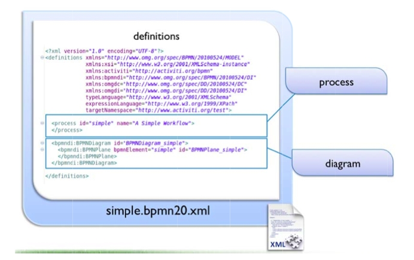

# Process definitions

You create an Activiti process definition in Alfresco using the BPMN 2.0 standard.

The following diagram shows a simple process definition and highlights the terminology used in BPMN 2.0.

The underlying definition is an xml file. The root element of the BPMN 2.0 schema is the definitions element, which can contain multiple process definitions. The following image show an empty process definition:

≈ A definitions element contains at least xmlns and targetNamespace declarations. The targetNamespace is an arbitrary string specified by you, and is useful for categorizing process definitions. The process element has two attributes:

-   **id**

    this is required and maps to the key property of an Activiti ProcessDefinition object. The id is used to uniquely identify this process definition, for example when configuring the user interface, or in the Activiti workflow console.

-   **name**

    this is optional and maps to the name property of a ProcessDefinition. The Activiti workflow engine itself does not use this property, but it is used in Alfresco Share for displaying the name in a user interface, so you should specify a name.

The BPMNDiagram element specifies the diagram interchange information for this process. The graphical design tool you use generates this information. This element will not appear when you are creating BPMN 2.0 process definition manually. The interchange information is used to re‐create the diagram both in another graphical designer and in the run‐time environment. Only one diagram is allowed per file, even though there may be more than one process definition.

-   **[Events](../concepts/wf-process-def-events.md)**  
 Events model something that happens during the lifetime of a process. In a diagram, Events are always visualized as a circle.
-   **[Sequence flows](../concepts/wf-process-def-sequence-flows.md)**  
 A sequence flow is the connector between two elements of a process.
-   **[Tasks](../concepts/wf-process-def-tasks.md)**  
 The integration of Activiti in Alfresco provides three types of tasks in a process definition.
-   **[Gateways](../concepts/wf-process-def-gateways.md)**  
 A gateway is used to model concurrency in a process. It is used to control the flow of execution, or in BPMN 2.0 terminology, the tokens of execution.
-   **[Variables](../concepts/wf-process-def-variables.md)**  
In an Alfresco Activiti process definition each property in the workflow task model corresponds to a variable available in your workflow.
-   **[Node objects](../concepts/wf-process-def-node-objects.md)**  
 In an Alfresco Activiti process definition Alfresco repository node references and associations are represented as alfresco Node objects in Activiti BPMN 2.0. An Alfresco node object is an object‐oriented view of an item in the Alfresco Repository. It provides accessors for retrieving and setting properties and traversing associations, and methods for performing alfresco actions such as checkin, checkout, and transforms.
-   **[Listeners](../concepts/wf-process-def-listeners.md)**  
 Listeners are an Activiti extension to BPMN 2.0 that implement hook points inside a process definition which are triggered by events during workflow execution. There are two type of listeners, task and execution.

**Parent topic:**[Creating and managing workflows](../topics/wf-howto.md)

**Related information**  

[BPMN 2.0 Specification](http://www.omg.org/spec/BPMN/2.0/)

