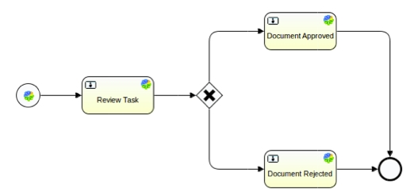
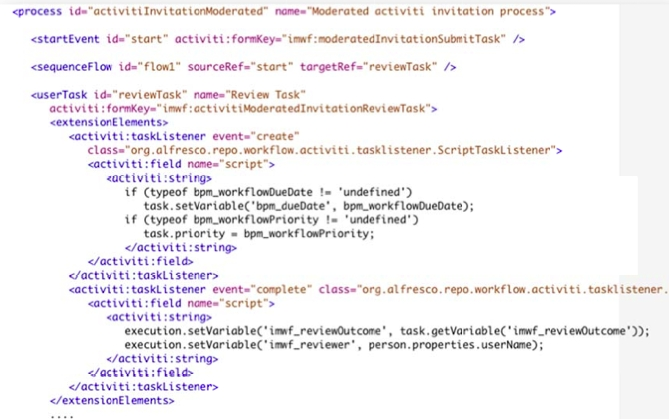

# What is a workflow?

In Alfresco a workflow is a sequence of connected tasks applied to a document or other item of content. Each task can be performed by a person, a group, or automatically.

For example, you might have a document that you needed reviewing and approving by a number of people. The sequence of connected tasks would be:

-   Send an email to each reviewer asking them to review the document within a certain time
-   Each reviewer reviews the document
-   Each reviewer approves or rejects the document
-   If enough reviewers approve, the task is completed successfully

Alfresco workflows automate the process for you. Users can choose from five workflow definitions provided in Alfresco. You can also create your own workflow definitions for more complex workflows. The five supplied workflow definitions are:

-   **Adhoc**

    Enables you to assign a task to a single user

-   **Group Review & Approve**

    Enables you to set up review and approval of content, assigning the workflow task to a single group

-   **Parallel Review & Approve**

    Enables you to set up review and approval of content, assigning the workflow task to multiple users.

-   **Pooled Review & Approve**

    Enables you to set up review and approval of content, assigning the workflow task to multiple users. One user can take ownership of the task at a time, completing it or returning it to the pool to be claimed by another user associated with the task.

-   **Review & Approve**

    Enables you to set up review and approval of content, assigning the workflow task to a single user

A graphical workflow modeler is often used to create a workflow. The following diagram shows a sample workflow taken from the workflow modeler running in Eclipse. The workflow consists of three tasks, a gate, and two events; start and end.

The Alfresco Activiti workflow engine executes BPMN 2.0 process definitions. BPNM 2.0 \(Business Process Model and Notation\) is an open standard developed by the Object Management Group \(OMG\) to provide a notation that is easily understandable by all business users: business analysts designing processes, developers implementing technology to perform those processes, and, business people managing and monitoring those processes. BPMN creates a standardized bridge for the gap between the business process design and process.

Standard BPMN 2.0 process definition models can be exchanged between graphical editors, and executed on any BPMN 2.0 compliant engine. Be aware that if you use technology specific features in your definition, you will not be able to use that workflow on a different technology. For example, if you define an Activiti workflow to work with Alfresco, you will not be able to run it on a TIBCO server.

The following image shows part of a BPMN 2.0 process definition:

**Parent topic:**[Creating and managing workflows](../topics/wf-howto.md)

