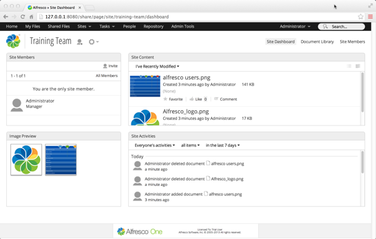
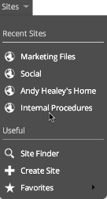
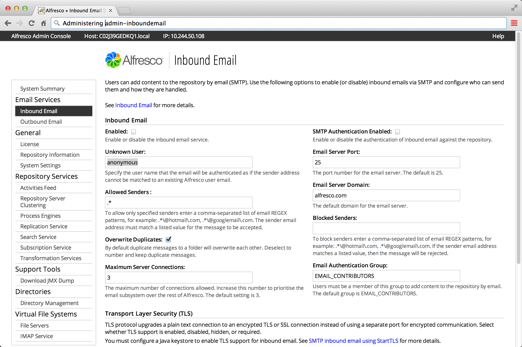

# What's new in Alfresco

At Alfresco we're always thinking up new ways to help you do great work.

We've detailed all the main updates and improvements here, starting with the things you'll see as a user, before moving onto the administrator improvements.

You can watch an overview of Alfresco One [here](../concepts/alfresco-tutorial-02.md).

**New Document Transformation Server 2.0.0 \(February 2017\)**

Alfresco One 4.2.7 comes with a new version of the Document Transformation Server. This release includes a new **Share** action that allows documents to be converted to pdf/a v2.

**New Google Docs integration 3.0 \(April 2015\)**

Alfresco Google Docs integration 3.0 has been updated because of recent changes to the Google APIs. From April 20 2015, Google is removing the Documents List API from service and previous versions of Alfresco Google Docs integration will no longer work.

The new Google Docs integration module works with the Google Drive API. This new module does not use iFrame, and so it now fixes some of the issues that were caused by the Google Docs user interface. For example, the **Share** button is now available within Docs, Sheets, or Slides. After opening the document in the appropriate Google app, use the **Share** button to collaborate with others.

You can also control the invited user's level of access with standard Google Docs settings, revoke access when the content is checked back into Alfresco, and it remembers who you have shared the document with in the past when editing sessions are renewed.

You can also now manage your Google Docs integration settings in the Repository Admin Console.

**New look and feel**

The first thing you’ll see when you open Alfresco is a brand new look. We've cleaned it up and made lots of changes to help you focus on what's important.

We've decluttered and relocated a few of the actions to the new settings icon . This is available at both site and user dashboard level.

We've also moved the **Dashboard**, **Document Library**, and **Members** links to the right-hand side of Alfresco.

And check out the new quick links in the Sites menu...

There's lots of other subtle changes that we'll let you discover for yourself, though many of them are so intuitive you might not realize that anything's changed!

\(Hint, have a look at the new Document Library and the new views available...\)

**Hybrid workflow**

Workflow processes works seamlessly between on-premise and the cloud. Start a workflow on-premise and automatically sync to the cloud and trigger a cloud-based workflow. See [how to start a cloud-based workflow](../tasks/cloud-hybrid-workflow.md).

**Download multiple items and folders**

This is the one you've been waiting for! Select your items/folders in the Document Library and download them as a zip file. Simple, and essential.

**Ring-fenced work areas**

There's a new My Files area where you can store your own personal content, and a Shared Files area where you can quickly share content with other users without adding it to a site.

**User Trashcan**

We've all deleted something by accident and had to go and ask our system administrator to help us get it back. Now when you delete items they go into your own user trashcan where you can easily retrieve them yourself if you need them back.

**Email management**

Opt in and out of site activity emails on a site by site basis, and control the number of activities in the emails.

**Improved Google Docs integration**

New one-click editing and save back actions make for a smoother user experience. [Setting up Google Docs integration](../concepts/googledocs-intro.md) is also much simpler and there's no longer a need for a 'system' Google account to be configured in the background.

**Standalone Admin Console**

Administering Alfresco just got a whole lot easier. You can change your Alfresco settings without running Alfresco Share, so you can get all your configuration sorted first before letting your users loose. The standalone [Admin Console](../concepts/at-adminconsole.md) has a huge range of options for you to configure, including tools for clustering and authentication, as well as a quick summary page to give you a supreme overview of your system.

Just go to *http://127.0.0.1:8080/alfresco/service/enterprise/admin/* in your browser \(replacing *127.0.0.1* with your server and *8080* with your port\) to get started.

You can also develop Admin Console components for your own extensions and custom tools.

There's even help text integrated in the console to assist you in getting set up.

**Clustering enhancements**

Clustering is now enabled by an enhanced license key. The setup and configuration have been simplified, and there are admin and validation tools included in the new Admin Console. Find out more about [Repository server clustering](../tasks/adminconsole-reposerverclustering.md). Also, see [Setting up clustering](../concepts/ha-intro.md) for more information.

**Authentication enhancements**

Authentication setup and configuration has also simplified, and again there are admin and validation tools included in the new Admin Console. Find out more about [Authentication directories](../concepts/adminconsole-directories.md).

**Transactional metadata query**

You can now use CMIS query for most query predicates and operators, avoiding the use of Lucene/Solr for queries that require transactional consistency. Find out more about [Transactional metadata query](../concepts/intrans-metadata.md).

**Extensibility**

-   The [Alfresco One API](../pra/1/topics/pra-welcome.md) is now available on Alfresco 4.2 in addition to Alfresco in the Cloud
-   The Alfresco One API now supports the [mandatory features of CMIS 1.1](../pra/1/concepts/cmis-1.1-intro.md)
-   Document Library extensible views to allow developers to more easily add custom views to the Document Library
-   Easier development and customization of Share/SpringSurf applications via widgets and extensibility hooks to avoiding code duplication and support easier upgrades

See what we've been up to, and follow our latest updates at [Alfrescodocs](https://twitter.com/Alfrescodocs).

**Parent topic:**[Alfresco One](../concepts/welcome-infocenter.md)

