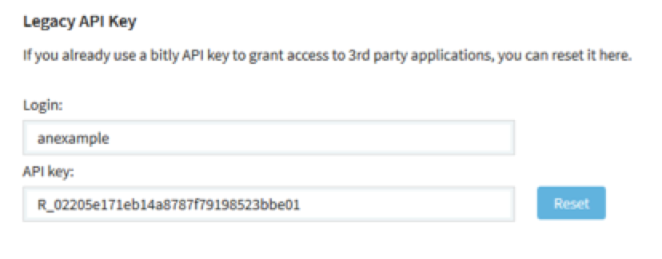

# Creating a Bitly user for social publishing

Within the social content publishing feature, Alfresco uses Bitly as the default URL shortener for publishing tweets and Facebook updates. To ensure that the URL shortener works from Alfresco, you need to subscribe to Bitly to generate an API Key, and then apply the user name and API key to configure Alfresco.

1.  Open a browser and navigate to the following URL:

    ```
    https://bitly.com/a/sign_up
    ```

2.  Type in a user name, email address, and password that you would like to use for this Bitly account.

3.  Click **Create account**.

4.  On the page that appears, click your user name on the right side of the screen, and then select **Settings**.

5.  On the **Settings** page, choose the **Profile** tab \(usually the default\).

    The profile settings show your email address and indicate that your email address is not yet verified.

6.  Check that the email address shown is correct and click the **Click here** link to verify your account.

    You will receive a verification email for the address you used in the profile settings. Check your inbox and follow the instructions in the email to confirm the address.

    **Note:** This is an automated email and it may be marked as spam.

    You will then see a page showing that the account verification was successful.

7.  On the **Settings** page, choose the **Advanced** tab.

    This screen shows two fields in the **Legacy API Key** section: **Login** and **API key**.

    For example:

    

    You will use the values of these two fields to configure Alfresco.

8.  Open the Alfresco global properties file <classpathRoot\> /alfresco-global.properties.

    Add the following properties using the **Login** and **API key** values from the Bitly settings page. For example:

    ```
    urlshortening.bitly.username=anexample
    urlshortening.bitly.api.key=R_a6689e13748149ccb35c4e1afadbb03e
    ```

    Where:

    -   **anexample**

        Is the login name from the Bitly account you created.

    -   **R\_a6689e13748149ccb35c4e1afadbb03e**

        Is the example API key generated from the Bitly account.

9.  Restart the Alfresco server to start using the Bitly settings for your social content publishing.


**Parent topic:**[Managing social content publishing](../concepts/admintools-channelsman-intro.md)

