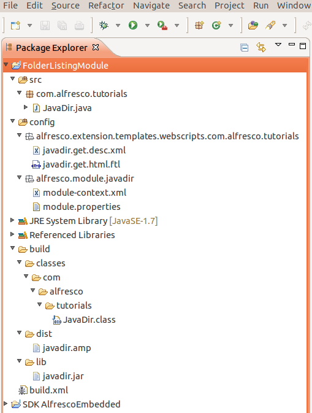

# Create the Ant build script

In this task you create a simple Ant build script that can be run from Eclipse. You will create an Ant script with several targets. The Ant script needs to create project directories, compile the Java code, package the resultant class files into a JAR, create an AMP file by zipping up the necessary files, and also install the AMP file using the MMT when required.

1.  In the Package Explorer right-click on the `FolderListingModule` project folder and select **New** \> **Other**.

2.  Browse to XML file and click **Next**.

3.  Enter the name build.xml and click **Finish**.

4.  Replace the contents of the file with the following:

    ```
    
                            
    <?xml version="1.0" encoding="UTF-8"?>
    <project default="package-amp">
    
    	<!-- Set these as required -->
    	<property name="alfresco.sdk" value="/home/tony/alfresco_sdk/lib"/>
    	<property name="spring.sdk" value="/home/tony/spring_framework/spring-framework-3.2.2.RELEASE/libs"/>	
    	<property name="alfresco.install" value="/home/tony/alfresco-4.1.5"/>
    	<property name="war.file" value="${alfresco.install}/tomcat/webapps/alfresco"/>
    	<property name="module.id" value="javadir"/>
    
    	<property name="project.dir" value="."/>
    	<property name="build.dir" value="${project.dir}/build"/>
    	<property name="config.dir" value="${project.dir}/config"/>
    	<property name="jar.file" value="${build.dir}/lib/${module.id}.jar"/>
    	<property name="amp.file" value="${build.dir}/dist/${module.id}.amp"/>
    
    	<property name="mmt.path" value="${alfresco.install}/bin/alfresco-mmt.jar"/>
    	<property name="mmt.install" value="install ${amp.file} ${war.file} -verbose"/>
    
    	<target name="mkdirs">
    		<mkdir dir="${build.dir}/dist" />
    		<mkdir dir="${build.dir}/lib" />
    	</target>
    	
    	<path id="class.path">
    		<dirset dir="${build.dir}" />
    		<fileset dir="${alfresco.sdk}" includes="**/*.jar"/>
    		<fileset dir="${spring.sdk}" includes="**/*.jar"/>
    	</path>
    	
    	<target name="compile">
    		<mkdir dir="${build.dir}/classes" />
    		<javac classpathref="class.path" srcdir="${project.dir}/src" destdir="${build.dir}/classes" />
    	</target>
    
    	<target name="package-jar" depends="compile">
    		<jar destfile="${jar.file}" >
    			<fileset dir="${build.dir}/classes" excludes="**/custom*,**/*Test*" includes="**/*.class" />
    		</jar>
    	</target>
    
    	<target name="package-amp" depends="mkdirs, package-jar" description="Package the Module" >
    		<zip destfile="${amp.file}" >
    			<fileset dir="${project.dir}/build" includes="lib/*.jar" />
    			<fileset dir="${project.dir}" includes="config/**/*.*" excludes="**/module.properties" />
    			<fileset dir="${project.dir}/config/alfresco/module/${module.id}" includes="module.properties" />
    		</zip>
    	</target>
    
    	<target name="update-war" depends="package-amp" description="Update the WAR file." >
    		<echo>Installing AMP ${amp.file} into WAR ${war.file}</echo>
    		<java jar="${mmt.path}" fork="true" failonerror="true">
    			<arg line="${mmt.install}"/>
    		</java>
    
    	</target>
    
    </project>
    
                        
    ```

    **Note:** This build file is a modified copy of the build file available in the SDK Basic AMP project included with the SDK.

    The main change is to enable the linking in of the necessary library files.

    **Attention:** At the top of the build file you will see a number of properties that you will need to edit to reflect your specific setup.

    The default target ensures that directories are created, code compiled, JAR file created and AMP file created. There is also a target `update-war` that can be used to patch the target WAR file using the MMT.

    This script can be run from Eclipse, or on the command line.

    **Note:** Note that the Java class in packaged in a JAR file. This JAR file is then located in the lib directory, as per the standard module directory structure. This file will then be mapped into the WEB-INF/lib directory in the target WAR file.


You have now constructed your Ant build script. To run the script in Eclipse you can simply right-click the build file and select **Run As** \> **Ant Build**. This will run the default target. If you want to run the `update-war` target \(which does not run by default\) you can right-click the build file, select **Run As**, and then select **External Tools Configurations**. You can then click on the **Targets** tab and select the `update-war` target. In the Eclipse console you will see output such as the following:

```

        
update-war:
     [echo] Installing AMP ./build/dist/javadir.amp into WAR /home/tony/alfresco-4.1.5/tomcat/webapps/alfresco
     [java] Installing AMP './build/dist/javadir.amp' into WAR '/home/tony/alfresco-4.1.5/tomcat/webapps/alfresco'
     [java] Backing up war DIRECTORY...
     [java] WAR has been backed up to '/home/tony/alfresco-4.1.5/tomcat/webapps/alfresco-1372341667119.bak'
     [java] WARNING: This version of this module is already installed in the WAR..upgrading.
     [java] Clearing out files relating to version '1.0' of module 'javadir'
     [java]    - Removing file '/WEB-INF/lib/javadir.jar' from war
     [java]    - Removing file '/WEB-INF/classes/alfresco/extension/templates/webscripts/com/alfresco/tutorials/javadir.get.desc.xml' from war
     [java]    - Removing file '/WEB-INF/classes/alfresco/extension/templates/webscripts/com/alfresco/tutorials/javadir.get.html.ftl' from war
     [java]    - Removing file '/WEB-INF/classes/alfresco/module/javadir/module-context.xml' from war
     [java]    - Removing file '/WEB-INF/classes/alfresco/extension/templates/webscripts/com/alfresco/tutorials' from war
     [java]    - Removing file '/WEB-INF/classes/alfresco/extension/templates/webscripts/com/alfresco' from war
     [java]    - Removing file '/WEB-INF/classes/alfresco/extension/templates/webscripts/com' from war
     [java]    - Removing file '/WEB-INF/classes/alfresco/extension/templates/webscripts' from war
     [java]    - Removing file '/WEB-INF/classes/alfresco/extension/templates' from war
     [java]    - Removing file '/WEB-INF/classes/alfresco/extension' from war
     [java]    - Removing file '/WEB-INF/classes/alfresco/module/javadir/modifications.install' from war
     [java]    - Removing file '/WEB-INF/classes/alfresco/module/javadir/module.properties' from war
     [java] Adding files relating to version '1.0' of module 'javadir'
     [java]    - File '/WEB-INF/lib/javadir.jar' added to war from amp
     [java]    - File '/WEB-INF/classes/alfresco/extension/templates/webscripts/com/alfresco/tutorials/javadir.get.desc.xml' added to war from amp
     [java]    - File '/WEB-INF/classes/alfresco/extension/templates/webscripts/com/alfresco/tutorials/javadir.get.html.ftl' added to war from amp
     [java]    - Directory '/WEB-INF/classes/alfresco/extension/templates/webscripts/com/alfresco/tutorials' added to war
     [java]    - Directory '/WEB-INF/classes/alfresco/extension/templates/webscripts/com/alfresco' added to war
     [java]    - Directory '/WEB-INF/classes/alfresco/extension/templates/webscripts/com' added to war
     [java]    - Directory '/WEB-INF/classes/alfresco/extension/templates/webscripts' added to war
     [java]    - Directory '/WEB-INF/classes/alfresco/extension/templates' added to war
     [java]    - Directory '/WEB-INF/classes/alfresco/extension' added to war
     [java]    - File '/WEB-INF/classes/alfresco/module/javadir/module-context.xml' added to war from amp
BUILD SUCCESSFUL
Total time: 13 seconds        
        
    
```

Once you have run the Ant script you will see the project directory structure has changed slightly in Eclipse:



In the next task you finish up by testing your installed module.

**Parent topic:**[Creating a Java-backed web script module with Ant](../tasks/dev-extensions-tutorials-java-web-script-module.md)

