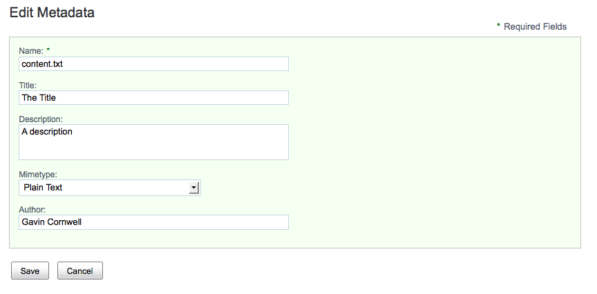
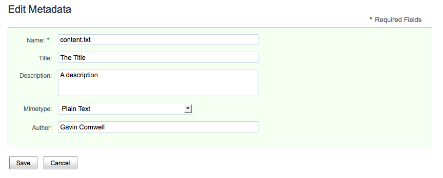

# Changing the field label position

By default, forms are rendered with the field labels positioned above the input control.



To change this layout, provide a custom CSS to override the default style rules. Control dependencies can be provided via custom configuration.

1.  Add the custom CSS in the custom-label-layout.css file, located in the /custom/forms directory within the web application.

2.  Add the following configuration:

    ```
    <config>
       <forms>
          <dependencies>
             <css src="/custom/forms/custom-label-layout.css" />
          </dependencies>
       </forms>
    </config>
    ```

3.  To move the labels to the left of the input control, the following CSS should be present in the custom-label-layout.css file:

    ```
    .form-container label
    {
       display: inline;
       float: left;
       text-align: right;
       width: 6em;
       margin-right: 1em;
       margin-top: 0.4em;
    }
    ```

4.  Save the file.

    The result of this customization is shown as:

    


**Parent topic:**[Forms](../concepts/forms-intro.md)

