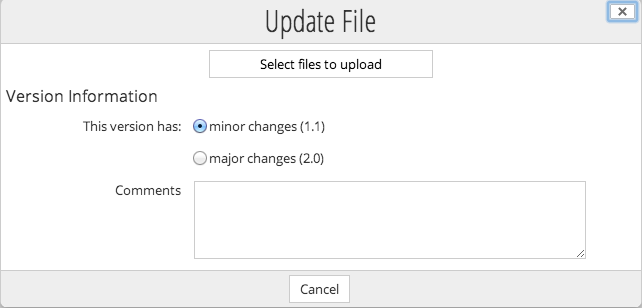

# Editing content

Updating your content in Alfresco is easy to do and you can even select whether to edit online, offline, or in Google Docs.

1.  In the Document Library item list, hover your cursor over one of the document.

    This highlights the item and displays the actions available for that item.

2.  Click **More** and then select **Edit Offline**.

    Alfresco now shows a notification that the document is locked. Depending on your browser the content will be either downloaded automatically, or you will need to choose a location to save it to.

    The document is saved to this location with **\(Working Copy\)** added to the title.

3.  Now open the document from this location using you're preferred software and make an edit it to it.

4.  When you've done that save and close it.

5.  Back in Alfresco, hover your curser over the document and click **Upload New Version**.

    

6.  In the Update File page click the browse icon and find and select the "Working Copy" document.

    **Note:** If you select a file with a different name or file type then this will be shown. You can continue as in the next step, cancel, or select a different file to upload. If you continue then the uploaded file name and/or file type will be used.

7.  Leave the version on minor changes and click **Upload**.

8.  When the upload is finished click **OK**, and a modification update is shown on-screen.

9.  Click **Site Dashboard** and you'll see update notifications in the dashlets.

This video shows the steps in the tutorial.

  

**Parent topic:**[Working with content](../concepts/gs-site-prepare.md)

