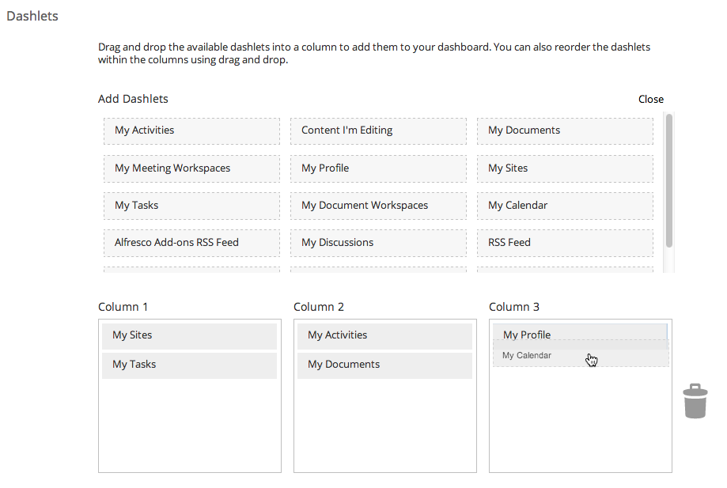

# Customizing your dashboard

You can customize your dashboard so that you only see the information that you're interested in.

**To customize your dashboard appearance and content:**

1.  Click  to show the Customize User Dashboard page.

2.  Click **Change Layout** to display the available layouts.

3.  Click **Select** for the Three columns option.

4.  Click **Add Dashlets** to display all the available dashlets.

5.  Drag and drop **My Profile** and then **My Calendar** to Column 3.

    

6.  Click **OK**.

    If you look at your dashboard now you can see that it's been updated with your dashlet choices.

7.  Now on the **Welcome to your dashboard** panel click **Remove**, then click **Yes**.

    **Tip:** You can also resize dashlets to line them up nicely - just click on the bottom of a dashlet then drag up and down to resize it.

Your dashboard is now customized exactly as you want it - this isn't fixed though, you can change the dashboard whenever you like. You can click My Dashboard from anywhere in Alfresco to take a look at your dashboard.

This video shows the steps in the tutorial.

  

**Parent topic:**[Personalizing Alfresco](../concepts/gs-personal-alfresco.md)

