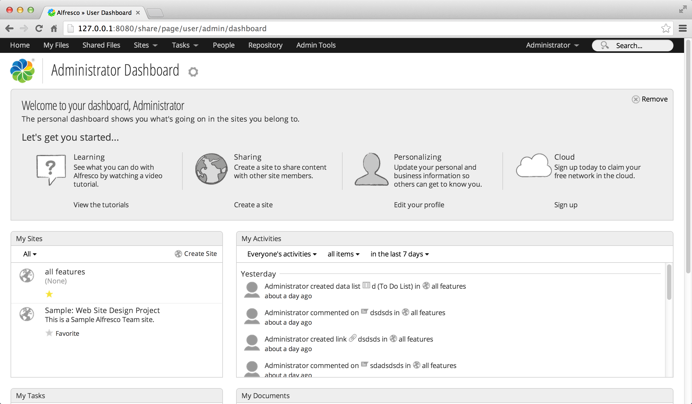

# Logging in

To start the tutorial you need to login to Alfresco.

1.  Enter the following on the login page:

    1.  **Username**: *your username*

    2.  **Password**: *your password*

    **Note:** You can get the login url from your Alfresco administrator. If you've downloaded Alfresco straight to your computer then the default url is *127.0.0.1:8080/share*.

2.  Click **Login**.

    This opens your personal Alfresco dashboard. You can now configure the dashboard so that it shows the information most important to you.

    

**Parent topic:**[Getting Started with Alfresco One](../concepts/gs-intro.md)

