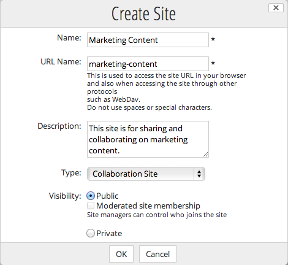

# Creating a site

The first thing that you need to do is to create a site framework.

1.  Click **Create Site** on the **My Sites** dashlet or click the **Sites** menu at the top of the screen and select **Create Site**.

    Whichever method you choose will open up the **Create Site** dialog box.

2.  Now enter site details as shown below. You'll notice that the URL Name is automatically created.

    -   Name: Marketing Content
    -   Description: This site is for sharing and collaborating on marketing content.
    -   Type: Collaboration Site
    -   Visibility: Public

        **Note:** By setting the site to **Public** all users in your organization can see and join the site. If you set the site visibility to **Private**, only users that you, the Site Manager invite will be able to see and join the site. See the Alfresco documentation [Alfresco sites](../concepts/sites-intro.md) for more information on site visibility settings.

    

3.  Click **OK** and the dashboard for your new site is now shown.

    Now that you've created a site, you can start to customize it, in much the same way as you did with your personal dashboard.

This video shows the steps in the tutorial.

  

**Parent topic:**[Building a site](../concepts/gs-building-site.md)

