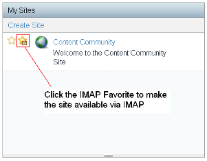
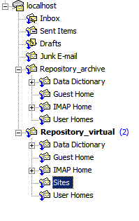

# Marking sites as IMAP favorites

To have access to Alfresco Share sites using IMAP, the site\(s\) need to be added to your list of sites using Share IMAP Favorites.

1.  Select **IMAP Favorites** in the Share **My Sites** dashlet on your **My Dashboard** page:

    

    

2.  Refresh your IMAP view to see the new sites.

    

    You can see the site added to the IMAP Sites folder.

**Parent topic:**[Configuring IMAP Protocol support](../concepts/imap-intro.md)

