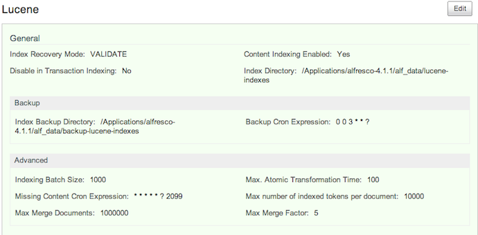

# Specifying the Lucene backup directory

This section describes how to specify the Lucene backup directory.

You can set the Lucene backup directory using the following three ways: by using the Admin Console in Share, by editing the alfresco-global.properties file or by using a JMX client, such as JConsole.

**Parent topic:**[Lucene index backup and restore](../concepts/backup-lucene-intro.md)

## Set up Lucene backup directory using Share Admin Console

You can only see the Admin Console if you are an administrator user.

1.  On the toolbar, expand the **More** menu, and then click **More** in the **Admin Tools...** list.

2.  Under the **Tools** section on the left navigation bar, you see various tools available and the options that you can set. In the **Search** sub-section, click on **Lucene**.

    The **Lucene** window is displayed.

    

3.  Click **Edit**.

4.  Edit the backup properties for the Lucene index by specifying when the backup occurs in the **Backup Cron Expression** text box.

5.  Specify the full path on the Alfresco server file system to store the index backup in the **Index Backup Directory** text box.

6.  Click **Save**.


## Specifying Lucene backup directory via alfresco-global.properties file

This task shows how to specify the Lucene backup directory via alfresco-global.properties file.

-   To set the Lucene backup directory and schedule, using the alfresco-global.properties file, set the  value of the following properties to the relevant cron expression and the full path where the backups should be kept:

    ```
    index.backup.cronExpression=0 0 3 * * ?
    dir.indexes.backup=${dir.root}/backup-lucene-indexes
    ```


## Specifying Lucene backup directory via JMX client

You can use the JMX client, JConsole to specify the backup directory for Lucene indexes.

-   To use JMX client to setup Lucene backup directory, navigate to **MBeans tab \> Alfresco \> Configuration \> Search \> managed \> lucene \> Attributes** and change the values for index.backup.cronExpression and dir.indexes.backup properties.


**Note:** You may notice that a .indexbackup\_temp directory is created during the backup of Lucene indexes. This is a temporary Lucene backup directory. During the backup process, the current indexes get copied into the temporary directory. After the backup is complete, the old backup directory is deleted and this temporary directory is renamed to the name of the Lucene index backup directory.

