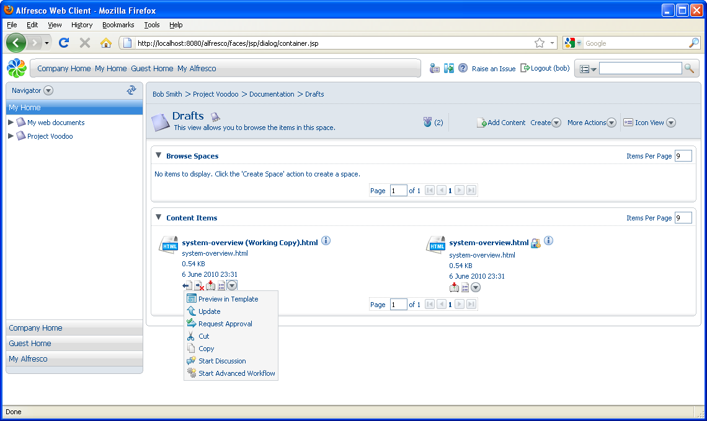
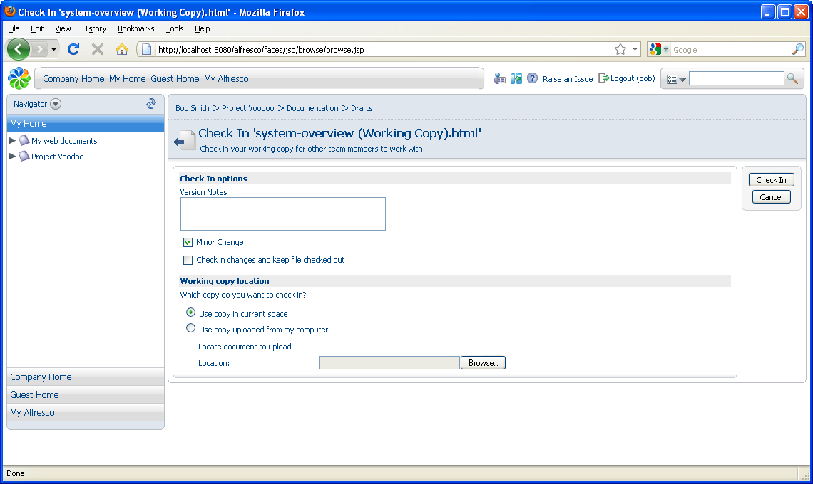

# Checking in a content item

The **Lock** icon displayed beside the original content item lets you know that it cannot be modified. The only way you can modify it is to check in or undo the check out on the working copy. If you are not the person who checked out the document, hover the mouse over the lock icon on the original item to display the author who is currently editing the item.

In this task, you are going to edit the document and add some minor changes to the text. Once saved, you can check in the content.

1.  Open the Working Copy of the file on your computer and make changes to the content.

    **Note:** You can use the **Update** action for a content item to upload changes to the working copy without checking in the file but for the purpose of this tutorial, we want to check in the file.

    

2.  Click  **\(Check In\)** associated with the content item.

    

3.  Indicate the revision as being a **Minor Change** and add notes, if desired.

4.  Click **Check In**.

**Parent topic:**[Editing content in a collaborative space](../concepts/cgs-edit-collaborativecontent.md)

