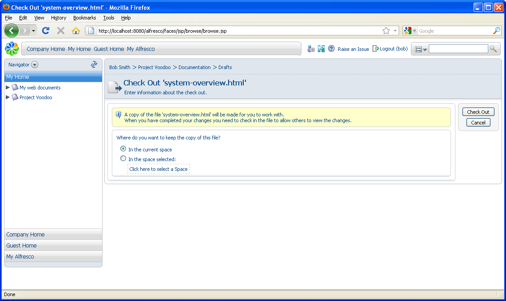
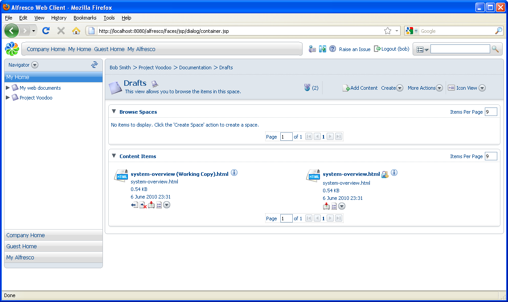

# Checking out a content item

In this task, you will check out content from a space so that others cannot modify the file with which you are working.

1.  In the Drafts space, click  and select **Check Out** for the document **system-overview.html**.

    You are given the choice of checking out the working copy to the same space as the original or to any other space. Some people like to work with one space that contains all their current work-in-progress, so may have created a specific folder in their home space for working copies. You are going to keep the working copy in the current space.

    

2.  Click **Check Out**.

3.  Click the link **system-overview \(Working Copy\).html** and save the file to your computer.

4.  Click **OK** to return to the space, which now contains two items. One is appended with **\(Working Copy\).**

    

**Parent topic:**[Editing content in a collaborative space](../concepts/cgs-edit-collaborativecontent.md)

