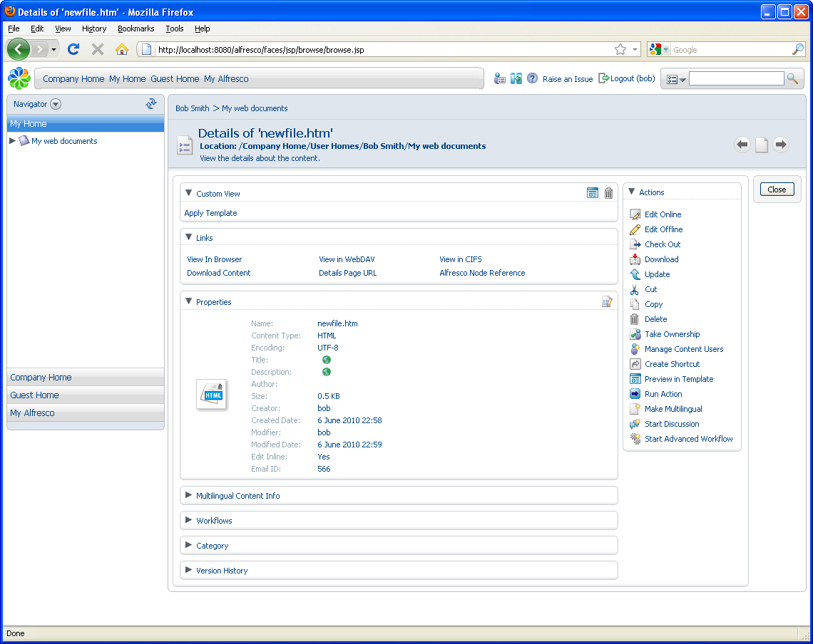

# Managing content item details

You can view the details \(properties and metadata\) of a content item at any time.

1.  Click  **\(View Details\)** associated with the content item to display the Details page with the Properties pane expanded.

    If you are not sure which icon performs what action, hover your mouse over the icon and a tool tip displays its action.

    

2.  Click  **\(Modify\)** on the top right of the Properties pane to edit the content properties. Click **OK** when done.

3.  Click the **View In Browser** link in the Links panel to view or download through the browser.

**Parent topic:**[Creating spaces and content](../tasks/tgs-create-spacecontent.md)

