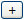

# Configuring the dashboard layout and contents

Configure the dashboard with the desired layout and components.

Workflow is managed from the dashboard. Therefore, if you plan to use advanced workflow as part of Alfresco, it is important that you configure your dashboard to handle the resulting workflow tasks. At the very least, you must be able to view the tasks assigned to you.

1.  In any space, click **My Alfresco**in the toolbar to open **My Alfresco** **Dashboard**.

2.  Click **Configure** on the right side of the space header.

    The Configure Dashboard Wizard opens.

3.  In Step One, Select Layout, select the desired layout style and click **Next**.

4.  In Step Two, Select Components, click an item in the **Available Components** list and click **Add**.

    The component appears in the **Selected Components** list.

5.  Reorder the components, as desired.

    The order of the components in the **Selected Components** list dictates the order they display in the dashboard. To change the order, click to select the item you want to reposition; click  to move the item up the list and click  to move the item down the list.

6.  Remove unwanted components from the **Selected Components** list.

    You can select only one component at a time to remove. To do this, click the unwanted component and click **Remove**.

7.  Click **Next** once the **Selected Components** list is complete and ordered as desired.

8.  In Step Three, Summary, review the configuration and click **Finish**.

    The dashboard configuration is saved and you return to the dashboard with your changes applied.

**Parent topic:**[My Alfresco Dashboard](../concepts/cuh-dashboard.md)

**Related information**  

[My Alfresco Dashboard](../concepts/cuh-dashboard.md)

