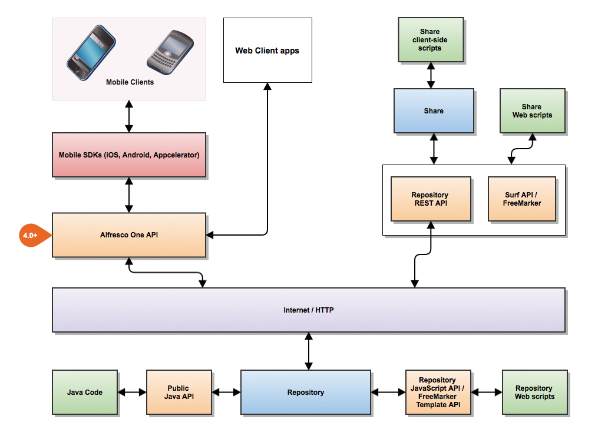

# Overview of Alfresco APIs

This reference describes the publicly available and supported APIs \(Application Programming Interfaces\) that enable developers to write applications that access Alfresco.

**Important:** It is important to note that any APIs not covered by this document are unsupported and subject to significant change.

Alfresco provides a wide range of APIs. This topic introduces the APIs available, and their typical use.

## Alfresco One API

This is the main public API for interfacing your client application with Alfresco. This RESTful API can be used to access both Cloud and On-Premise Alfresco repositories. The Alfresco One API provides the ability to access core repository functionality through a CMIS API, and Alfresco-specific functionality, such as management of Sites, can be accessed through the Alfresco One REST API. This is the recommended API for developing client applications that need to access both On-Premise and Alfresco in the Cloud.

For detailed information see the [Alfresco One documentation](../pra/1/topics/pra-welcome.md).

## Alfresco Repository JavaScript API

This API is a JavaScript API used primarily for the development of web scripts that execute in the repository tier. Web scripts are extensions to Alfresco that can be written and built without requiring compilation, and therefore have a reduced development time. The web scripts are accessed using URLs, so can be thought of as providing the ability to create custom REST APIs. Many web scripts that use the Repository JavaScript API are provided as standard.

For more detailed information see the [Web Scripts documentation](ws-webscripts.md).

## Alfresco Repository Freemarker Template API

This API provides a wide-range of objects and methods for creating scripts using the FreeMarker templating language, that execute in the Repository tier. It provides a more limited API than the Repository JavaScript API, but with the convenience of using a simpler templating language, rather than a more complex scripting language such as JavaScript.

For more detailed information see the [Web Scripts documentation](ws-webscripts.md).

## Alfresco Repository REST API

This API provides access to the core repository functionality using a RESTful approach. This is useful where the developer does not want to, or have a need to, write custom web scripts, and is developing a client-side application. This API can be thought of as a ready-built collection of web scripts that can be called from any client capable of making REST requests and receiving the associated responses.

For more detailed information see the [Repository REST API documentation](../references/RESTful-intro.md).

## Alfresco Share JavaScript APIs \(client side\)

The Alfresco User Interface application, Share, provides a number of APIs. The Alfresco Share Client-side API is a JavaScript API to help create client-side extensions to Share. It is mainly used for UI customizations. Similarly, the Share Extras API is a JavaScript API that facilitates the creation of Share Extras, which can be thought of as plug-in user interface elements for Share.

For more detailed information see the [Share Client-side API documentation](../references/API-JS-Share-intro.md).

## Alfresco Surf Platform API

Surf is a server-side UI platform that is used by Share. It is possible to write web scripts that tap into this platform and execute in the UI tier. The Surf Platform API provides a JavaScript API to allow you to construct such web scripts, which can be used to customize and extend the Share UI.

For more detailed information see the [Presentation-tier documentation](ws-presentation-intro.md).

## Alfresco Java Public API

When you need to create new services in Alfresco, or develop applications or customizations that cannot be implemented at the web script level, it is necessary to write those extensions in Java. Alfresco provides numerous Java-level APIs, which are documented through the JavaDoc system. Links to the JavaDoc documentation can be found on the [Alfresco Developer Site](http://dev.alfresco.com/resource/AlfrescoOne/5.0/PublicAPI/). While in theory it is possible to access the complete range of Java APIs, there is a [list of recommended Public Java API calls](java-public-api-list.md). Where possible it is strongly recommended that your application limits itself to this list, so that your application works on future versions of Alfresco.

## CMIS

Alfresco Repository is fully CMIS-compliant. If as a developer you wish to create a client that can access any CMIS repository, you can use the CMIS API. Note that the Alfresco One API uses the CMIS API for repository access and is documented in the [Alfresco One API documentation](../pra/1/topics/cmis-welcome.md).

Further information on CMIS can be found at the [CMIS web site](https://www.oasis-open.org/committees/tc_home.php?wg_abbrev=cmis). The Apache Chemistry project provides various implementations of the CMIS standard. Further information can be found at the [Chemistry project site](https://chemistry.apache.org/project/cmis.html).

-   **[Using embedded APIs](../concepts/serv-api-embedded-about.md)**  
Embedded APIs are used by custom extensions executed directly against the content application server.
-   **[Using Remote APIs](../concepts/serv-api-remote-about.md)**  
Remote APIs allow clients connecting from a separate tier to communicate with the Alfresco content application server. Remote APIs are based on web services and RESTful and CMIS protocols, and are language agnostic, allowing you to develop against these APIs using a range of languages including Java, PHP, Ruby, and .NET.

**Parent topic:**[Developing](../concepts/dev-for-developers.md)

