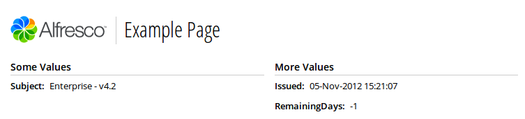
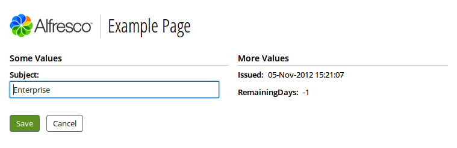

# Alfresco Admin Console Example page

When you customize the Alfresco Admin Console, you can use the example page as a starting point.

The Admin Console example page is called admin-example and contains comments to help you to understand the code.

The files that you use for working with the example Admin Console page are:

-   [admin-example.get.js](http://dev.alfresco.com/resource/AlfrescoOne/5.0/configuration/alfresco/enterprise/webscripts/org/alfresco/enterprise/repository/admin/admin-example.get.js)
-   [admin-example.get.html.ftl](http://dev.alfresco.com/resource/AlfrescoOne/5.0/configuration/alfresco/enterprise/webscripts/org/alfresco/enterprise/repository/admin/admin-example.get.html.ftl)
-   [admin-example.get.desc.xml](http://dev.alfresco.com/resource/AlfrescoOne/5.0/configuration/alfresco/enterprise/webscripts/org/alfresco/enterprise/repository/admin/admin-example.get.desc.xml)
-   [admin-example.get.properties](http://dev.alfresco.com/resource/AlfrescoOne/5.0/configuration/alfresco/enterprise/webscripts/org/alfresco/enterprise/repository/admin/admin-example.get.properties)

See the [Web script components](ws-components.md) section for more information on these files.

There are also additional properties files that contain the associated strings for localized content in the supported languages.

The following snippet shows the controller code from the admin-example.get.js file, which retrieves the `Subject`, `Issued`, and `RemainingDays` properties from the `License` JMX bean:

```
<import resource="classpath:alfresco/enterprise/webscripts/.../admin-common.lib.js">
/* Repository Admin Console - Example GET method */
Admin.initModel(
   "Alfresco:Name=License",
   ["Subject", "Issued", "RemainingDays"],
   "admin-example"
);
```

The following snippet shows the template code from the admin-example.get.html.ftl file:

```
<#include "admin-template.ftl" />
<@page title="Example Page">
   <div class="column-left">
      <@section label="Some Values" />
      <@control attribute=attributes["Subject"] />
   </div>
   <div class="column-right">
      <@section label="More Values" />
      <@control attribute=attributes["Issued"] />
      <@control attribute=attributes["RemainingDays"] />
   </div>
</@page>
```

The resulting output from the admin-example web script displays the following:



The values from the License JMX bean are read-only. The template macros understand when the JMX beans are read-only, and therefore, display the text as read-only.

When the JMX beans are editable or if you want to show a different form field, add the following line to change the template:

```
<@attrtext attribute=attributes["Subject"] />
```

The resulting output then displays the following:



**Parent topic:**[Customizing the Alfresco Admin Console](../concepts/adminconsole-custom.md)

**Related information**  


[Web Scripts](ws-overview.md)

[Launching the Admin Console](../tasks/adminconsole-open.md)

