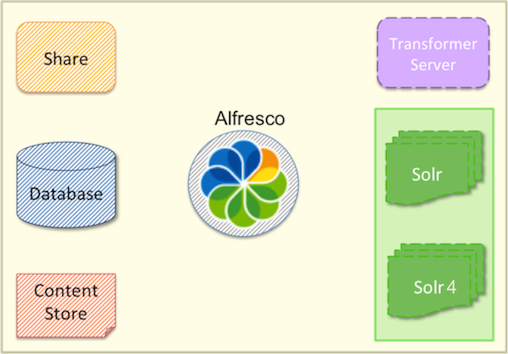

# Components of an Alfresco solution

This information gives an overview of the main components of your Alfresco solution.

Within your Alfresco solution, you have components such as Share, Alfresco, database, indexes \(Solr\), transformations, and the content store. As illustrated in the following diagram, some of these components can be clustered while others are optional.

**Clusterable components**

-   Share
-   Alfresco
-   Content store
-   Database

**Non-clusterable and replicable components**

-   Transformation Server
-   Solr index
-   Solr 4 index

It is important to decide how many Alfresco installations you need and which of the specified components you will put on which node.

To explain this further, let's consider an example. Assume that your application has six nodes. Ideally, Alfresco recommends that you should have one component on each node. So, for example, node1 has database, node2 is content store, node3 is Alfresco, node4 is Share, node5 is Solr, and node6 is Transformation Server.

Use the following table as a template to design your Alfresco solution.

|Clusters/ nodes|Alfresco components|DNS|IP address \(optional\)|Additional information|
|---------------|-------------------|---|-----------------------|----------------------|
|1|Database| | | |
|2|Content store| | | |
|3|Alfresco| | | |
|4|Share| | | |
|5|Solr| | | |
|5|Solr 4| | | |
|6|Transformation Server| | | |

However, you can configure your distribution differently. Each distribution and clustering solution has its own advantages and disadvantages. To configure distribution and clustering optimally, contact [Alfresco Consulting](http://www.alfresco.com/services/consulting) or your Alfresco certified partner.

For a better understanding of initiating clustering for high availability and high throughput, see [Scenario: Clustering for redundancy](cluster-scenario-redundancy.md) and [Scenario: Clustering for high throughput](cluster-scenario-throughput.md).

**Parent topic:**[Upgrading a cluster](../tasks/upgrade-cluster.md)

