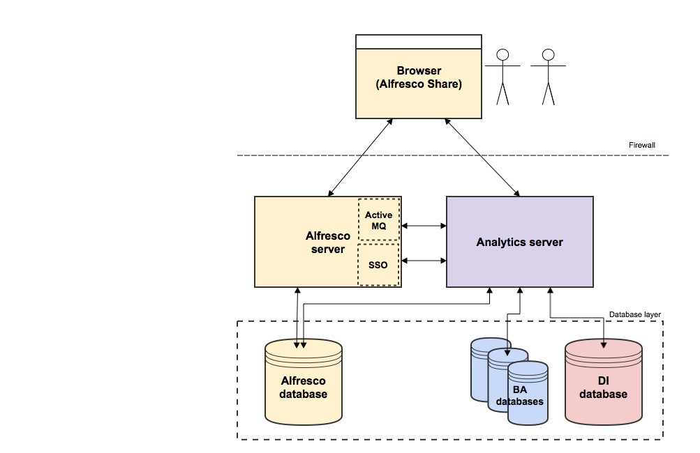

# Analytics architecture

There are a number of components that comprise the Alfresco Analytics architecture.

Reports are rendered and displayed to Business Analysts in Alfresco Share, based on Alfresco events that are captured and stored in databases. For more information, see [Alfresco Analytics flow of data](analytics-detailed-architecture.md).

Alfresco Share sends and receives requests from the Alfresco server and database, and the Analytics server and databases. The Analytics server comprises a Business Analytics \(BA\) server, a Data Integration \(DI\) server, event listeners, and data integration software for performing Extract, Transform and Load \(ETL\) jobs from the databases.

ActiveMQ monitors for events and we recommend that you install it on the Alfresco server, particularly if you have other Alfresco components that use ActiveMQ. If you are using ActiveMQ solely for Alfresco Analytics, you might prefer to install ActiveMQ on the Analytics server, but ensure that it resides on one server only.

Single Sign-On \(SSO\) flows between the Alfresco and Analytics servers. See [Web services and Alfresco Analytics](../tasks/analytics-sso.md) for more information.

There are three Business Analytics \(BA\) databases, comprising Pentaho Quartz, Hibernate and JackRabbit \(JCR\) databases, that contain the Analytics report definitions. The Data Integration \(DI\) database can be either PostgreSQL or MySQL and contains the report data.

See [step 4 of the initial Analytics installation](../tasks/analytics-install-basic.md#where) for more information about where to install the Analytics installation components.

For information about configuring the Analytics server and databases, see [Configuring Alfresco Analytics](analytics-config.md). This information also explains how to configure the message service \(ActiveMQ\), the message listeners and the database extract tool \(Kettle\).

