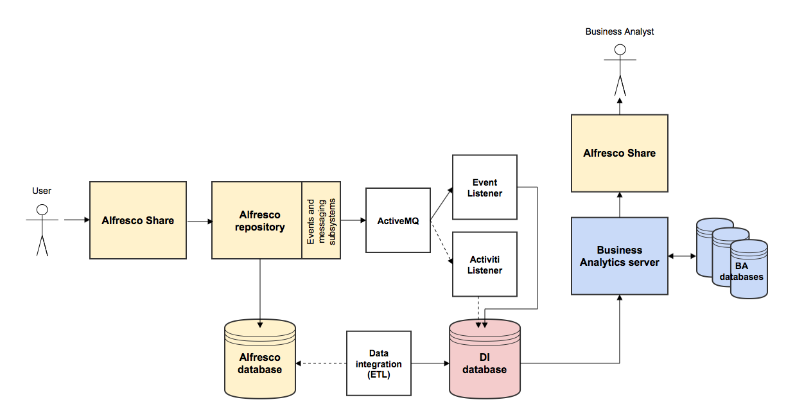

# Alfresco Analytics flow of data

When an event is triggered; for example, when a user adds a new document or comment through Alfresco Share, there is a flow of events that take place before a Business Analyst can query the data and produce reports.

An example flow of events is as follows:

1.  A user logs on to Share and uploads a new document.
2.  The document is stored in the Alfresco repository.
3.  The document creation event is captured by the events and messaging subsystems in Alfresco and the data is stored in the Alfresco database.
4.  The event is captured by an ActiveMQ JMS queue.
5.  The Event Listener pulls the message from ActiveMQ \(in this instance, the Activiti Listener is not involved, because this is not a business process event\).
6.  The message persists to the Data Integration database \(either PostgreSQL or MySQL, depending on your configuration\).
7.  The data in the Alfresco database is parsed and transformed by Kettle using ETL \(Extract, Transform and Load\) jobs and is also passed to the Data Integration database.
8.  The Data Integration database communicates with the Business Analytics server \(which stores the report definitions in the BA databases\).
9.  A Business Analyst logs on to Alfresco Share, and is presented the document creation event data for manipulation and reporting.

