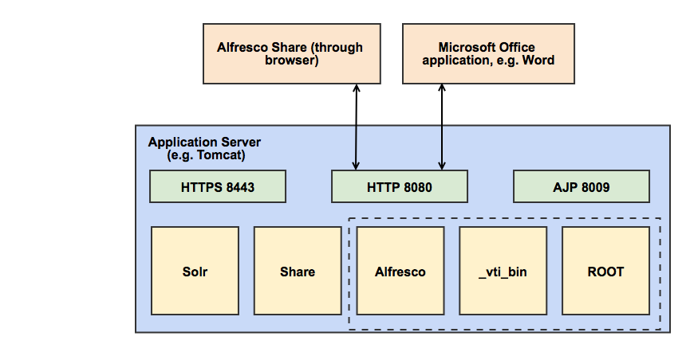
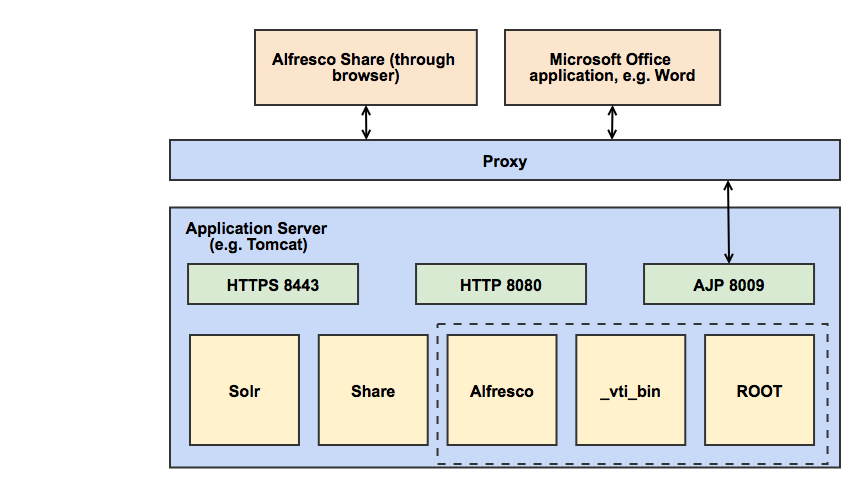

# Installing and configuring Alfresco Office Services

Alfresco Office Services \(AOS\) allow you to access Alfresco directly from all your Microsoft Office applications.

AOS, which is installed as a core part of Alfresco, provides a fully-compatible SharePoint repository that allows Microsoft Office Suite applications \(for example, Word, PowerPoint and Excel\) to interact with Alfresco as if it was SharePoint. AOS enables online editing for Office documents within Alfresco Share and allows users to modify Office files without checking them in and out. Alfresco locks the file while it is being modified and releases the lock when the file is saved and closed.

Because AOS is integrated into the core Alfresco repository, there is no separate AMP file to install or upgrade. If you are installing the Alfresco repository manually, there are some additional steps to include to get AOS working. See the guidance in [Installing the Alfresco WARs](../tasks/alf-war-install.md). If you are deploying to a different application server, you will need to set the context path during deployment. See [Deploying Alfresco with a different context path](../tasks/deploy-contextpath.md) for more information.

It is important to note the URL required to access Alfresco from a Microsoft Office application. For more information, see [Using Alfresco from Microsoft Office](aos-user.md). The following diagram shows the architecture of AOS in relation to an Alfresco installation:

AOS function comprises the Alfresco, \_vti\_bin and ROOT war files. Communication is over HTTP with either the Alfresco repository \(through Alfresco Share\) or directly from a Microsoft Office application.

If you are using a proxy server to handle SSL communication, the proxy handles the communication with Share and Microsoft Office through an AJP port \(if you are using Tomcat\). For more information about setting up a proxy server, see [Secure Sockets Layer \(SSL\) and the Alfresco repository](configure-ssl-intro.md). The architecture is as follows:

AOS replaces and enhances the Microsoft SharePoint Protocol Support that was available in previous versions of Alfresco.

-   **[Prerequisites for using Alfresco Office Services](../concepts/aos-prereqs.md)**  
There are a number of software requirements for using AOS.
-   **[Considerations when using Alfresco Office Services](../concepts/aos-issues.md)**  
Use this information to understand some of the dependencies that you might encounter when using Alfresco Office Services \(AOS\).
-   **[Upgrading Alfresco Office Services from a previous version of Alfresco](../tasks/aos-upgrade.md)**  
AOS replaces the Microsoft SharePoint Protocol Support that was delivered as a separate AMP file in previous versions of Alfresco. Use this information if you are a previous user of Microsoft SharePoint Protocol Support and need to upgrade.
-   **[Configuring Alfresco Office Services](../concepts/aos-config.md)**  
This information will help you to configure AOS for your environment.
-   **[Troubleshooting Alfresco Office Services](../concepts/aos-troubleshooting.md)**  
Use this information to help diagnose any problems when using Alfresco Office Services \(AOS\).

**Parent topic:**[Installing](../concepts/master-ch-install.md)

**Related information**  

[Installing Alfresco using setup wizards](installs-eval-intro.md)

[Installing Alfresco](ch-install.md)

[Installing the Alfresco WAR](../tasks/alf-war-install.md)

