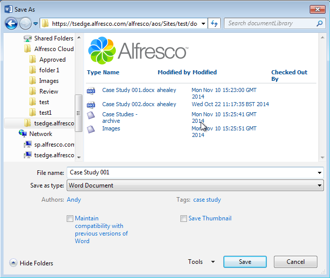

# Using Alfresco from Microsoft Office

With Alfresco Office Services \(AOS\) you can access Alfresco directly from your Microsoft Office applications.

This means that you can browse, open, and save Microsoft Office files \(Word, PowerPoint, and Excel\) in Alfresco without the need to access Alfresco through Chrome, Firefox, or another web browser.

You can also browse Alfresco from Windows Explorer, or map a network drive to Alfresco.

This is all done by entering an Alfresco web address from Microsoft Office applications and just giving it a slight modification.

**Alfresco server**

To connect with Alfresco the URL needs to end in "*/alfresco/aos*", so if your Alfresco address is

*https://mycompany.com*

then you'd enter

*https://mycompany.com/alfresco/aos/*

**Alfresco Cloud**

To connect with Alfresco you need to add "*sp*" to the URL, so if your Alfresco address is

*https://my.alfresco.com/share/mycompany.com/sitename/*

then you'd enter

*https://sp.alfresco.com/mycompany.com/sitename/*

For Alfresco Cloud you always need to enter a site name. For both Alfresco server and Alfresco Cloud you can enter URLs that are specific to a site, folder, or file, for example, *https://mycompany.com/alfresco/aos/Sites/sitename/documentLibrary/foldername/filename* for Alfresco server and *https://sp.alfresco.com/mycompany.com/sitename/foldername/filename* for Alfresco Cloud.

-   Site or folder-specific URL - browse through the site or folder to find the file you want
-   File-specific URL - open the file directly

Depending on whether you're using Windows or Mac, there are a few differences to how you do all this, and you'll need to be online.

**Note:** Alfresco administrators can find out more about installing and configuring AOS [here](aos-intro.md)[here](http://docs.alfresco.com/5.0/concepts/aos-intro.html).

There are lots of ways that using Alfresco from Microsoft Office will help you to work more efficiently, so we've pulled together just a few examples.

-   **[Opening Alfresco files from Microsoft Office \(Windows users\)](../tasks/aos-open-file.md)**  
You can open files stored in Alfresco directly from Microsoft Office apps.
-   **[Mapping a network drive to Alfresco \(Windows users\)](../tasks/aos-map-drive.md)**  
You can map a network drive to Alfresco so that you always have easy access to your files.
-   **[Opening Alfresco files from Windows Explorer \(Windows users\)](../tasks/aos-open-explorer.md)**  
You can open files stored in Alfresco directly from Windows Explorer.
-   **[Connecting to Alfresco from a Mac \(Mac users\)](../tasks/aos-docconnect-mac.md)**  
Microsoft Office for Mac has a tool called the Microsoft Document Connection.
-   **[Alfresco File Properties in Microsoft Office](../references/aos-props.md)**  
Files stored in Alfresco can have lots of properties to help identify and track them. You can see these when you click the Info tab when you have a file open in Microsoft Office.

**Parent topic:**[Using Alfresco from other applications](../topics/outside-alfresco.md)

