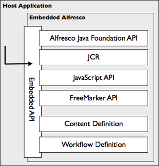

# Embedded APIs

The Embedded API is used for developing extensions to the Alfresco content application server. Extensions deployed into the server often depend on existing services provided by the server. Therefore, developers of extensions use the Embedded API to gain access to those services.

The Embedded API comes in several forms, where each form is structured for a particular need or kind of extension:

-   [Alfresco Public Java API](java-public-api-list.md) - a set of public Java interfaces exposed by services built into the Alfresco content application server
-   JavaScript API - an object-oriented view of the Java Foundation API specifically tailored for use in JavaScript. There is a [JavaScript API for the repository tier](API-JS-intro.md) and a [JavaScript API for the Share tier](../references/APISurfPlatform-intro.md).
-   [FreeMarker API](../references/API-FreeMarker-intro.md) - an object-oriented view of the Java Foundation API specifically tailored for use in FreeMarker templates
-   Content Definition - an API for creating and editing content models
-   Workflow Definition - an API for defining business processes

The JavaScript and Template APIs are the key building blocks for web scripts to develop the RESTful APIs.

Web scripts are a popular extension for the Alfresco content application server. They allow you to define your own Remote API for clients to interact with the Alfresco content application server. A web script implementation can use any of the Embedded APIs, such as the Public Java API, JavaScript, and FreeMarker, for its implementation. Developing your own Remote API is very useful for the following scenarios:

-   Exposing new extension services deployed into the Alfresco content application server to remote clients
-   Providing alternate batching or transaction demarcation of existing services
-   Creating a facade for integration with a third-party tool, such as a Forms engine

There is another use case for the Embedded API. An application or client can also directly embed the Alfresco content application server to inherit its suite of content services.

The infrastructure of the server means it can be deployed into a number of environments, not just as a web application. Essentially, the Alfresco content application server is treated as a library, where any of its services, including the content repository, can be chosen independently or mixed to provide a custom solution. The server can scale down as well as up.

**Parent topic:**[APIs](../concepts/api-about.md)

