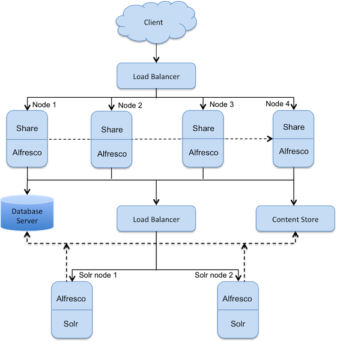

# Scenario: Clustering for high throughput

This is a scenario-based topic describing the clustering architecture for maximizing throughput of Alfresco services.

This scenario shows a single repository database and content store. There are four nodes with Alfresco/Share and two nodes with Solr search subsystem, all accessing the content simultaneously. This set up provides a higher level of availability, reliability, and scalability, thereby maximizing the throughput of various Alfresco services. Nodes in a cluster are positioned behind a load balancer that delegates requests to cluster members based on any one member’s ability/availability to handle the load.

Each Alfresco/Share instance is deployed into its own Tomcat servlet container. Alfresco services and CPU runtime footprint are optimized for high throughput under heavy concurrency with such a deployment. The load balancer fronts the cluster, and directs traffic to the member of the cluster most able to handle the current request.

**Note:** All the servers in a cluster should have static IP addresses assigned to them.

**Parent topic:**[How to split](../concepts/how-to-split.md)

