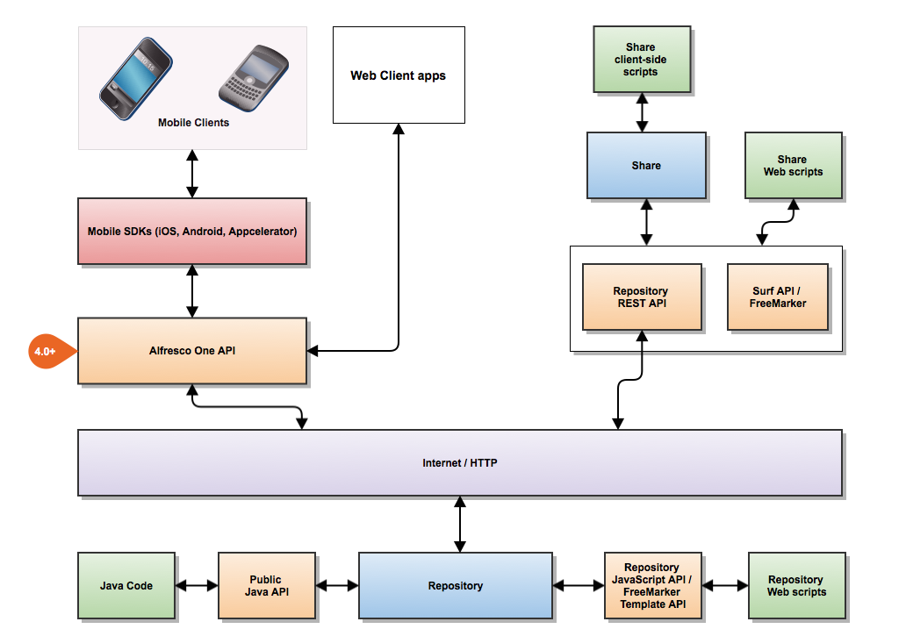

# API Guide

Alfresco supports a range of APIs \(Application Programming Interfaces\) to enable developers to write applications that access the Alfresco content repository, both on-premise and cloud.

**Important:** It is important to note that any APIs not covered by this document are unsupported and subject to significant change.

Alfresco provides a wide range of APIs.

The following diagram illustrates the key Alfresco APIs:

As the above picture shows, there are three different kinds of customizations that you can build for Alfresco. Platform embedded extensions, Share embedded extensions, and remote extensions, also referred to as integrations.

On the platform \(server side\) you can add Java code and JavaScript code to extend the platform with new custom functionality such as Java Services, Repository Web Scripts, Actions, Scheduled jobs and more. These extensions are embedded in the Platform application and run in the same JVM as the Alfresco Platform. When developing platform extensions you use the [Public Java API](java-public-api-list.md)and the [Repository JavaScript API](API-JS-intro.md) and [Repository Freemarker Template API](../references/API-FreeMarker-intro.md).

On the web client side you can extend Alfresco Share with new pages, dashlets, document library actions and more. These extensions are embedded in the Share web application and run in the same JVM as Alfresco Share. When developing Share extensions you use the [Aikau Widget and Services Reference/API](http://dev.alfresco.com/resource/docs/aikau-jsdoc/) and the [Spring Surf API](ws-presentation-intro.md).

Finally, you can also build stand-alone applications and web clients that talk to the Alfresco Repository remotely. These integrations will use the [REST API](../pra/1/topics/pra-welcome.md).

In the following topics you will obtain a brief overview of the APIs, their use cases, and links to further information.

