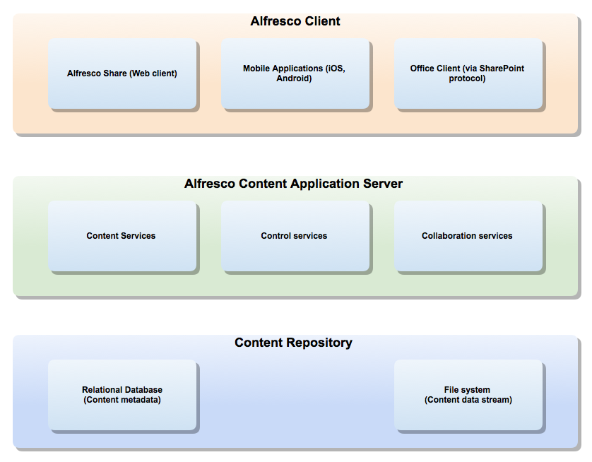

# Architectural Overview

Alfresco at its core is a repository that provides a store for content, and a wide range of services that can be used by content applications.

The Alfresco repository provides storage for documents and other content. The content metadata is stored in a relational database, while the content itself is stored directly on the filesystem. The relationships between content items, and their various properties \(metadata\) are defined in one or more content models. Content models can be thought of as describing types of content. As well as the basic content storage functionality, the Alfresco server provides a wide range of content-related services. These include core services such as the Document Folder Service, and the Version Service. There are also higher-level services such as Thumbnail Service \(for creating thumbnail images and renditions of documents\), the Site Service used for creating and managing sites in the Share application, and the Tagging Service, which provides the ability to tag content with keywords. The following sections of this documentation provide a brief tour of the available services.

Typically these services are implemented in Java, and expose an API described by the [Public Java API](http://dev.alfresco.com/resource/AlfrescoOne/5.0/PublicAPI/).

The Alfresco Server is highly extensible. You can write extensions in Java, JavaScript and FreeMarker, you can write client applications in any language using our REST APIs. You can customize existing content models, or create new ones, that define new content types, metadata, and relationships. You can create business workflow processes using Activiti BPMN, and define custom actions that the repository will carry out when certain events happen \(such as when new content is added to the repository\). You can even create new services if required.

The following sections of this documentation look at various extension points, the services provided by the Alfresco server, the APIs you can leverage, and even how you can customize and extend client applications such as Share. There are many tutorials to follow, as well as reference materials to study.

-   **[Alfresco Repository](../concepts/dev-repository-intro.md)**  
The Repository plays a pivotal role in the Alfresco content application server. The repository provides the main storage area for all content, including metadata.
-   **[Alfresco Services](../concepts/serv-using-about.md)**  
Services are core to the Alfresco content application server and are used by all applications communicating with the server.

**Parent topic:**[Developing](../concepts/dev-for-developers.md)

