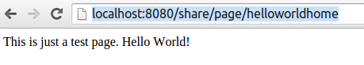
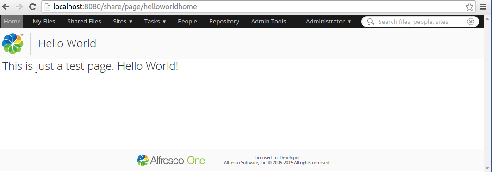
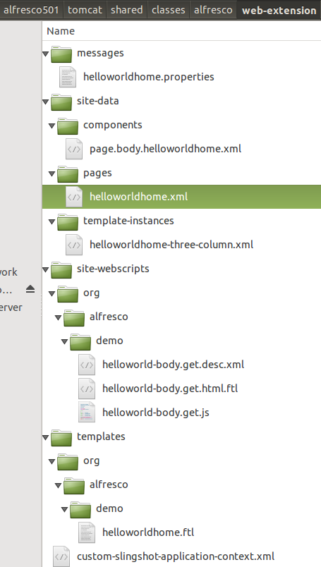

# Introduction to Surf Pages

This section gives a brief introduction to Surf Pages.

Let's see how we can implement a Hello World page with the old school Surf Page framework.

The following steps are needed to add a Surf Page:

-   Add a Surf Page definition file \(XML\)
-   Add a Template Instance file \(XML\)
-   Add a physical Template file \(FTL\)
-   Add a properties file \(.properties\) - Optional but good practice
-   Add Web Script\(s\) that fetches content to display \(if you have `page` scoped regions and use an existing template\)

Let's start out with the page definition file, create a file called `helloworldhome.xml` in the alfresco/tomcat/shared/classes/alfresco/web-extension/site-data/pages directory. You will have to create the site-data and pages directories. We are not using a build project to be able to focus solely on Surf.

Add the following XML to the file:

```
<?xml version='1.0' encoding='UTF-8'?>
<page>
   <title>Hello World Home</title>
   <title-id>page.helloworldhome.title</title-id>
   <description>Hello World Home Description</description>
   <description-id>page.helloworldhome.description</description-id>
   <template-instance>helloworldhome-three-column</template-instance>
   <authentication>none</authentication>
</page>
```

Here we are defining the title and description of the page both hard-coded in the definition, and as references to a properties file with labels \(i.e. the `title-id` and `description-id` elements\). The page will not require any authentication, which means we cannot fetch any content from the Alfresco Repository from it. It is also going to use a three column template, or that is the idea, you can name the template instance whatever you want.

Now create the template instance file called `helloworldhome-three-column.xml` in the alfresco/tomcat/shared/classes/alfresco/web-extension/site-data/template-instances directory. You will have to create the template-instances directory:

```
<?xml version='1.0' encoding='UTF-8'?>
<template-instance>
   <template-type>org/alfresco/demo/helloworldhome</template-type>
</template-instance>
```

This file just points to where the FreeMarker template for this page will be stored. So create the alfresco/tomcat/shared/classes/alfresco/web-extension/templates/org/alfresco/demo directory path. Then add the `helloworldhome.ftl` template file to it:

```
This is just a test page. Hello World!
```

Continue with the properties file for the page title and description. Create a file called `helloworldhome.properties` in the alfresco/tomcat/shared/classes/alfresco/web-extension/messages directory. You will have to create the messages directory:

```
page.helloworldhome.title=Hello World 
page.helloworldhome.description=Hello World Home Description
```

This file just points to where the FreeMarker template for this page will be stored. We also need to tell Alfresco Share about the new resource file, rename the `custom-slingshot-application-context.xml.sample` to `custom-slingshot-application-context.xml`, it is located in the web-extension directory. Then define the following bean:

```
<bean id="org.alfresco.demo.resources" class="org.springframework.extensions.surf.util.ResourceBundleBootstrapComponent">
  <property name="resourceBundles">
     <list>
        <value>alfresco.web-extension.messages.helloworldhome</value>
     </list>
  </property>
</bean>
```

To test this page you will have to restart Alfresco. It can then be accessed via the `http://localhost:8080/share/page/helloworldhome`. The page does not look very exciting:



So we are missing both the Share header and footer, which turns out to be global components that we can easily include. We just need to change the template file a bit. Open up the `helloworldhome.ftl` file and change it so it looks like this:

```
<#include "/org/alfresco/include/alfresco-template.ftl" />
<@templateHeader></@>
<@templateBody>
   <@markup id="alf-hd">
   <div id="alf-hd">
      <@region scope="global" id="share-header" chromeless="true"/>
   </div>
   </@>
   <@markup id="bd">
    <div id="bd">
        <h1>This is just a test page. Hello World!</h1>
    </div>
   </@>
</@>
<@templateFooter>
   <@markup id="alf-ft">
   <div id="alf-ft">
      <@region id="footer" scope="global" />
   </div>
   </@>
</@>
```

What we are doing here is first bringing in another FreeMarker file called `alfresco-template.ftl` that contains, you guessed it, FreeMarker template macros. We then use these macros \(elements starting with `@`\) to set up the layout of the page with header and footer. The header and footer content is fetched via the `share-header` and `footer` global scope components \(Web Scripts\). To view the result of our change we need to restart the server again, after this we should see the following:



So that looks a bit better. The next thing we want to do is to make the page a bit more dynamic, currently we have hard-coded the content for the page in the template. Let's add a Web Script that will return the content to display. This will require us to update the template with an extra region as follows:

```
<#include "/org/alfresco/include/alfresco-template.ftl" />
<@templateHeader></@>
<@templateBody>
   <@markup id="alf-hd">
   <div id="alf-hd">
      <@region scope="global" id="share-header" chromeless="true"/>
   </div>
   </@>
   <@markup id="bd">
    <div id="bd">
        <@region id="body" scope="page" />
    </div>
   </@>
</@>
<@templateFooter>
   <@markup id="alf-ft">
   <div id="alf-ft">
      <@region id="footer" scope="global" />
   </div>
   </@>
</@>
```

We have called the new region `body` and set `page` scope for it. This requires us to define a new component for this region. This can be done either in the page XML, or as a separate file in the site-data/components directory, we will do the latter. Create the components directory and add a file called `page.body.helloworldhome.xml` to it:

```
<?xml version='1.0' encoding='UTF-8'?>
<component>
  <scope>page</scope>
  <region-id>body</region-id>
  <source-id>helloworldhome</source-id>
  <url>/components/helloworld/body</url>
</component>      
```

The component file names follow a naming convention: `global | template | page>.<region-id>.[<template-instance-id | page-id>].xml` The URL for this component points to a Web Script that will return the Hello World message. Start implementing it by creating a descriptor file called `helloworld-body.get.desc.xml` located in the alfresco/tomcat/shared/classes/alfresco/web-extension/site-webscripts/org/alfresco/demo directory:

```
<webscript>
    <shortname>helloworldbody</shortname>
    <description>Returns the body content for the Hello World page.</description>
    <url>/components/helloworld/body</url>
</webscript>
```

Note that the URL is the same as we set in the component definition. Now implement the controller for the Web Script, create a file called `helloworld-body.get.js` in the same place as the descriptor:

```
model.body = "This is just a test page. Hello World! (Web Scripting)";      
```

The controller just sets up one field in the model with the Hello World message. Now implement the template for the Web Script, create a file called `helloworld-body.get.html.ftl` in the same place as the descriptor:

```
<h1>${body}</h1>      
```

Restart the server. Then access the page again, you should see the Hello World message change to "This is just a test page. Hello World! \(Web Scripting\)".

To summarize a bit, the following is a picture of all the files that were involved in creating this Surf page the old school way:



What you could do now is extend the Hello World page with some more sophisticated presentation using the YUI library. If you do that you end up with the pattern for how most of the old school Share pages have been implemented.

Next we will have a look at how to implement the same Hello World page the new way with [Aikau](dev-extensions-share-architecture-extension-points-intro-aikau-pages.md).

[Back to Share Architecture and Extension Points](dev-extensions-share-architecture-extension-points.md).

**Parent topic:**[Share Architecture](../concepts/dev-extensions-share-architecture-extension-points.md)

