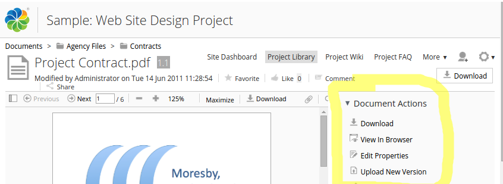
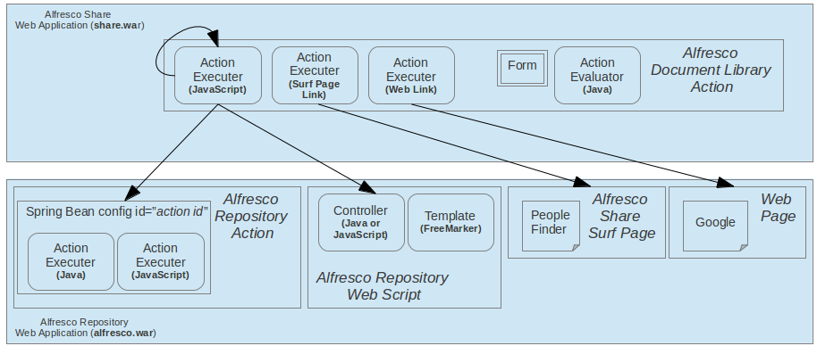
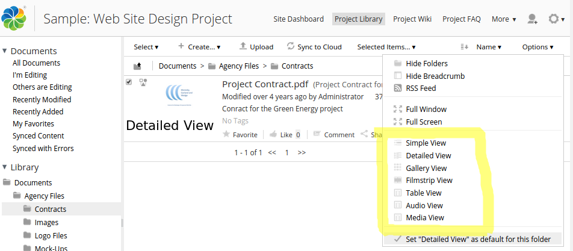

# Document Library

The Document Library page has several extension points that can be used to customize its behaviour, such as actions.

|Extension Point|Document Library|
|---------------|----------------|
|Architecture Information|[Share Architecture](dev-extensions-share-architecture-extension-points.md).|
|Description|The Document Library in Share is probably the most comprehensive Surf page \(note that it has not yet been converted to Aikau\) in the whole application. And hence you will have a number of extension points available so you can customize according to customer requirements.

The following list describes the different Document Library sub-extension points:

-   **Actions** - The document library page has lots of actions that you can use to manipulate the content you are looking at, whether it is a file or folder, such as Download. It is also possible to add your own actions so you can process content in a domain specific way.
-   **Indicators** - A content item in the Document library can have zero or more so called indicators, they can be used to denote certain states of the content, such as a file has been emailed. You can add your own indicators, they would typically be used together with an action.
-   **Metadata templates** - Whenever you view a list of folders or files in the Browse view there is a small number of metadata properties displayed. You can define custom metadata templates to control what metadata is displayed for a specific content type.
-   **Views** - When you are browsing the Document Library it is possible to select how to view it. By default the Detailed View will be active, but you can also select from the following views: "Simple", "Gallery", "Filmstrip", "Table", "Audio", and "Media". If none of these views fit your needs it is possible to define custom views.

Most of these sub-extension points are actually part of the [Share Configuration](dev-extensions-share-configuration.md) extension point as they are applied via XML configuration in share-config-custom.xml. It is really just the Actions sub-extension point that will involve coding.

 The following picture shows an example of how the *Document Actions* looks like in the UI:

 

 If you are viewing a Folder instead of a file you will be looking at *Folder Actions*.

 There are a number of ways in which these Document Library actions can be implemented. The following picture illustrates:

 

 So an action can be implemented as a client side JavaScript function that calls a Repository Action or a Web Script via AJAX. And an action can also just link directly to an existing Share Page. And finally, it is possible to have an action link to an external page.

 Next picture shows you the *views*:

 

 The Detailed View is currently active and the drop down to the right shows you the other available views. An *indicator* looks like this for a file:

 

 In this case a workflow was started, and there is a little icon indicating that this file is part of a workflow. The default *metadata template* for files looks like this:

 

|
|Deployment - App Server|-   tomcat/shared/classes/alfresco/web-extension/share-config-custom.xml \(Untouched by re-depolyments and upgrades\)
-   The following locations are inside the exploded Share WAR, so **not** recommended, use a [Share AMP](../tasks/alfresco-sdk-tutorials-share-amp-archetype.md) SDK Project instead:
-   tomcat/webapps/share/components/documentlibrary/actions - DocLib Action JavaScript implementation and icon go here
-   tomcat/webapps/share/components/documentlibrary/indicators - status indicators icons go here

|
|[Deployment - SDK Project](../tasks/alfresco-sdk-tutorials-share-amp-archetype.md)|-   share-amp/src/main/resources/META-INF/share-config-custom.xml - configuration for actions, indicators, views etc
-   Or even better, put all the configuration in a Surf Extension Module:
-   share-amp/src/main/amp/config/alfresco/web-extension/site-data/extensions/doclib-actions-extension-modules.xml - configuration for actions, indicators, views etc
-   share-amp/src/main/resources/META-INF/components/documentlibrary/actions - DocLib Action JavaScript implementation and icon go here
-   share-amp/src/main/resources/META-INF/components/documentlibrary/indicators - status indicators icons go here

|
|More Information|-   [The Site Document Library](../tasks/library-access.md)
-   [Extending the Alfresco Share Document Library](Share-Doclib-Extend-Intro.md)

|
|Tutorials|-   [Adding a new Document Library action](../tasks/dev-extensions-share-tutorials-add-action-doclib.md)
-   [Adding a menu item to the "Create..." menu in DocLib](../tasks/dev-extensions-share-tutorials-add-menuitem-create-menu.md)
-   [Override and extension examples](doclib-override-extension-examples.md)
-   [Customizing document library views](share-customizing-document-library-views.md)
-   [Configure aspect visibility](../tasks/share-repodoclib-aspects.md)
-   [Jeff Potts Alfresco Developer Series: Adding Repo and DocLib actions](http://ecmarchitect.com/alfresco-developer-series-tutorials/actions/tutorial/tutorial.html) - a very thorough walk-through of how to develop Repository Actions and Document Library actions, a must read.

|
|Alfresco Developer Blogs|-   [Share Document Library Extensions in v4.0](http://blogs.alfresco.com/wp/developer/2011/09/26/share-document-library-extensions-in-v4-0/)

|

**Parent topic:**[Share Extension Points](../concepts/dev-extensions-share-extension-points-introduction.md)

