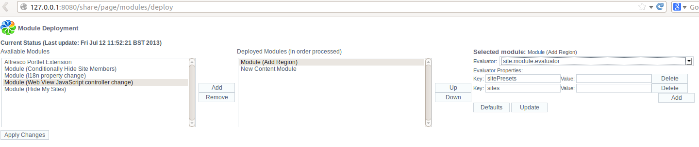

# Module deployment and evaluators

You can deploy Surf Extension Modules and change their behavior using evaluators.

Surf Extension Modules can be deployed using the facility provided at `http://localhost:8080/share/page/modules/deploy`. Available modules are listed and can be deployed by selecting the module, clicking **Add**, and then clicking **Apply Changes**.

Once a deployed module is selected, an evaluator can be selected, and its properties set, using the same interface, as shown in the following screen capture:



The mechanism shown allows the default module operation to be overridden.

The functionality of a deployed module might not be applicable to every request, so it is possible to associate an evaluator with a module. The evaluator runs to evaluate whether or not the request is applicable to the module. Alfresco Surf will automatically apply the default evaluator on each request. When you deploy the module you have the option of using the default evaluator, or selecting another, which might be a custom written evaluator.

The default module evaluator is configured in the Spring application context with the `id` `default.extensibility.evaluator`. This maps to the class `org.springframework.extensions.surf.extensibility.impl.ApproveAllModulesEvaluator` which will always evaluate to true.

Another evaluator available as standard has the bean `id` of `config.approval.evaluator`. If you select this as the evaluator when deploying a module you will see that it asks for a single property with the key `apply` which determines whether or not the target module gets applied. If you set the value of `apply` to `true` then the module will always be applied, if you set it to anything else then the Module will never be applied.

**Attention:** If you make changes to the evaluator and its properties on the Module Deployment page in Share, it is importnat to click **Update** to update the module configuration and then **Apply Changes** to persist these changes.

It is important to note that many evaluators are never configured from this user interface. Instead they are included in the component definition, with no human interaction needed. The evaluator will instead use data from the Alfresco Repository, or somewhere else, to determine if the component should be rendered or not.

Here is an example of a search instructions component that is added to the search page. It has an evaluator defined, so when the module is deployed via the UI there is no need to configure an evaluator manually:

```
<extension>
    <modules>
        <module>
            <id>Custom Search Instructions</id>
            <components>
                <component>
                    <region-id>search</region-id>
                    <source-id>search</source-id>
                    <scope>page</scope>
                    <sub-components>
                        <sub-component id="custom-search-instructions" index="25">
                            <url>/alfresco/training/search/instructions</url>
                            <evaluations>
                                <evaluation id="HideIfDisplaySearchInstructionsIsFalse">
                                    <evaluators>
                                        <evaluator type="org.alfresco.training.hideSearchInstructions"></evaluator>
                                    </evaluators>
                                    <render>false</render>
                                </evaluation>
                            </evaluations>
                        </sub-component>
                    </sub-components>
                </component>
            </components>
        </module>
    </modules>
</extension>
```

-   **[Auto-deploying modules](../concepts/dev-extensions-share-module-autodeploy.md)**  
Surf Extension Modules can be deployed automatically.

**Parent topic:**[Surf Extension Modules](../concepts/dev-extensions-share-surf-extension-modules.md)

