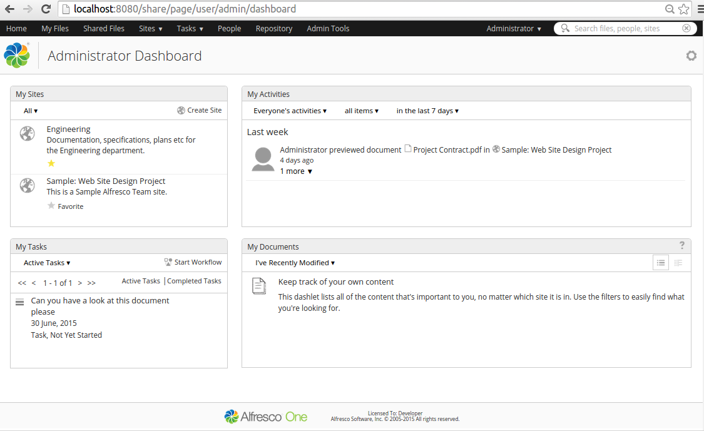
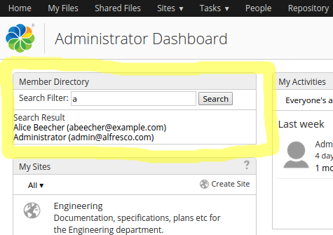
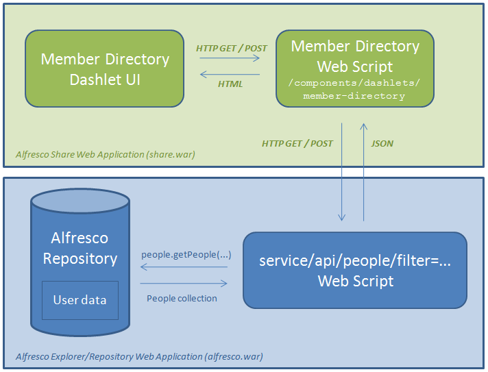

# Surf Dashlets

The Share web application has a special page called Dashboard, which contains windows \(think Portlets\) of content called Dashlets. Currently most of these Dashlets are Spring Surf Dashlets, but they will eventually be converted to Aikau Dashlets.

|Extension Point|Surf Dashlets \(It is recommended to use [Aikau Dashlets](dev-extensions-share-aikau-dashlets.md) instead\)|
|---------------|-----------------------------------------------------------------------------------------------------------|
|Architecture Information|[Share Architecture](dev-extensions-share-architecture-extension-points.md).|
|Description|The following picture shows a User Dashboard with a number of Dashlets, such as My Sites and My Tasks:

 

 You can implement your own custom Dashlets that can be added to either the User Dashboard or the Site Dashboard.

Creating a Surf Dashlet is the same thing as creating a Surf Web Script. Before continuing read through the [Surf Web Scripts section](dev-extensions-share-surf-web-scripts.md). The controller of the Dashlet Presentation Web Script will usually call a Data Web Script on the Alfresco Repository side to get the content that should be displayed in the Dashlet.

Let's look at an example of a custom Dashlet, the following picture shows a Member Directory Dashlet that can be used to search the User/People directory:

 

 This Dashlet is implemented using a Presentation Web Script, which in turn uses a Data Web Script to get the people matching the Search Filter parameter. The following picture illustrates:



 In this case we have a Spring Surf Web Script on the Share side that will, in its controller, call a Repository Web Script \(i.e. Data Web Script\) to get a list of person records in JSON format. The controller looks something like this:

```
// Get args from the Share page URL
var filterValue = page.url.args["filter"];
var connector = remote.connect("alfresco");
var peopleJSONString = connector.get("/api/people?filter=" + filterValue);

// create json object from data
var peopleJSON = jsonUtils.toObject(peopleJSONString);
model.people = peopleJSON["people"];  
```

The controller makes use of a special root object called [remote](surf-connectors-endpoints.md), which is used to connect to a remote service, such as the Alfresco Repository, and get data. The JSON data is returned from a Repository Web Script \(i.e. Data Web Script\), which in its controller uses Alfresco's public API to fetch person information matching passed in Search Filter \(i.e. `filter`\).

The Repository Web Script uses a root object called `people` to search for person info. This root object is Alfresco specific and is only available in Repository Web Scripts.

Now, to create a Dashlet Web Script you also need a descriptor, which is defined in XML and looks something like this:

```
<webscript>
    <shortname>Member Directory</shortname>
    <description>Provide Search of people and display in a list</description>
    <family>user-dashlet</family>
    <url>/components/dashlets/member-directory</url>
</webscript>   
```

The descriptor looks like any other Web Script descriptor except the `family` parameter, which can have the following values:

-   `user-dashlet` - A Web Script that implements a Dashlet that can be added to a User Dashboard
-   `site-dashlet` - A Web Script that implements a Dashlet that can be added to a Site Dashboard
-   `dashlet` - A Web Script that implements a Dashlet that can be added to any Dashboard

The Dashlet UI needs to be implemented in the Web Script template as follows:

```
<#-- JavaScript Dependencies
<@markup id="js">
</@>
-->

<#-- Stylesheet Dependencies
<@markup id="css">
</@>
 -->

<#-- Surf Widget creation
<@markup id="widgets">
    <@createWidgets group="dashlets"/>
</@>
-->

<@markup id="html">
    <@uniqueIdDiv>
        <#assign id = args.htmlid?html>
        <#assign dashboardconfig=config.scoped['Dashboard']['dashboard']>

        <div class="dashlet">
            <div class="title">${msg("member.directory.dashletName")}</div>
            <div id="${id}-memberdir" class="body">

                <div class="toolbar">
                    <div class="actions">
                        <form name="input"
                              action="${url.context}/page/user/${context.user.id}/dashboard"
                              method="get">
                        ${msg("member.directory.searchFilter")}: <input type="text" name="filter" />
                            <input type="submit" value="Search" />
                        </form>
                    </div>
                </div>

                <p valign="top">
                    <span>${msg("member.directory.searchResult")}</span>
                    <#list people as p>
                        <br/>
                        <a href="${url.context}/page/user/${p.userName}/profile">
                        ${p.firstName} ${p.lastName} (${p.email})
                        </a>
                    </#list>
                </p>

            </div>
        </div>
    </@>
</@>   
```

Here we are not using any custom client side JavaScript or CSS. Instead we use a simple HTML only based UI with default out-of-the-box styling. In the markup you will see references to i18n labels such `${msg("member.directory.searchResult")}`. These messages are defined in the Web Script properties file as follows:

```
member.directory.dashletName=Member Directory
member.directory.searchFilter=Search Filter
member.directory.searchResult=Search Result   
```

|
|Deployment - App Server|-   tomcat/shared/classes/alfresco/web-extension/site-webscripts/ \(Untouched by re-depolyments and upgrades\)
-   tomcat/webapps/share/components/dashlets/ \(when web resources are included you need to put them directly into the exploded webapp, this is NOT recommended.\)

 Best practice is to put the files in a directory that explains what they are for, such as for example:

tomcat/shared/classes/alfresco/web-extension/site-webscripts/org/alfresco/training/components/dashlets

|
|[Deployment - SDK Project](../tasks/alfresco-sdk-tutorials-share-amp-archetype.md)|-   share-amp/src/main/amp/config/alfresco/web-extension/site-webscripts/
-   share-amp/src/main/resources/META-INF/components/dashlets \(when web resources such as CSS and JS are included\)

|
|More Information|-   [Share Extras Project](http://share-extras.github.io/) - Contains loads of Dashlets, good place to go and look at how different types of Dashlets can be implemented.

|
|Sample Code|-   [Custom Surf Pages, Surf Dashlets, and Surf Web Scripts](https://github.com/Alfresco/alfresco-sdk-samples/tree/alfresco-50/all-in-one/add-surf-dashlet-and-page-share)

|
|Tutorials|-   [Share Extras Project](http://share-extras.github.io/) - Look at the source code for the dashlets in this project

|
|Alfresco Developer Blogs| |

**Parent topic:**[Share Extension Points](../concepts/dev-extensions-share-extension-points-introduction.md)

