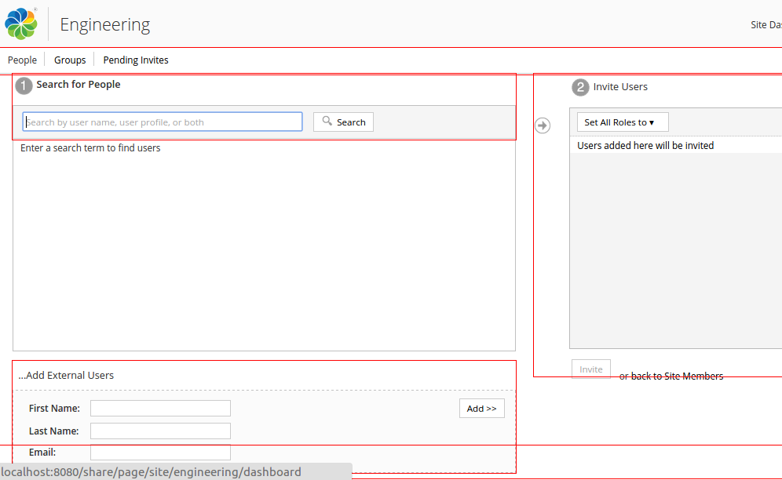

# Introduction to Surf Extension Modules

This section introduces you to the Spring Surf extension modules, which are the preferred way of customizing many of the Alfresco Share user interface features.

If you look in the tomcat/webapps/share/WEB-INF/classes/alfresco directory of your Alfresco installation, then you’ll notice a number of files ending with -config.xml, such as for example share-config.xml. These files contain configuration that is loaded into a Spring bean when Alfresco starts and is accessed by Share code to dictate many different aspects of its behaviour.

To customize this configuration you would **not** normally change these files directly, but instead make your changes in the tomcat/shared/classes/alfresco/web-extension/share-config-custom.xml file, which overrides the default configuration in the exploded Share webapp. Changes to web-extension/share-config-custom.xml can be done at runtime and take effect after a Share Web Script Refresh. However, there is no way from the UI to disable or enable configuration, you need file system access. There is also no easy and straight forward way to split up the configuration in different units, name them, and version them.

Further on, with the web-extension/share-config-custom.xml file it is not possible to work with Surf pages and components. You can for example not add a component to a page, update a component, or hide a component.

This is where *Spring Surf Extension Modules* comes into the picture, they enable dynamic control of the Share configuration at runtime from the user interface. Extension Modules also give you full control over a Surf Page in that you can add, update, and remove components that it is made up of. These modules can be deployed and un-deployed without restarting the server. Note however that installing a new module requires a server restart.

Extension modules makes it more straight forward to organize, name, version, and manage your configuration. Instead of having everything in one long share-config-custom.xml file, configuration can now be named and kept in different modules so it is easy for an Administrator to deploy and un-deploy different configuration settings at runtime.

Each module is processed for every request that comes into the Share web application to determine what configuration that should be applied. If a module should only be processed for certain requests, then [evaluators](dev-extensions-share-evaluators.md) can be used to determine when a module should be processed. This is an improvement to how the share-config-custom.xml configuration works, which is applied to all requests and you cannot add any evaluators.

Extension modules are defined in XML files that are stored under the tomcat/shared/classes/alfresco/web-extension/site-data/extensions directory.

Now, let's look at how to use an extension module to implement a Share customization. In the following sample customization we want to hide the External User Invite functionality in a site. The following picture illustrates what component we want to hide in the Invite Users page:


To hide this component we need to find out the `region-id`, `source-id`, and `scope` for it so we can use that when defining the extension module. If you are not up to speed on Surf see [Spring Surf deep dive](surf-fwork-intro.md). We can get to this information by using a tool called SurfBug \([more info on how to enable this tool](dev-extensions-share-surfbug.md)\). When this tool is enabled, and we refresh the page, red lines will show up and mark the different components on the page:



Clicking the component area brings up an information window with all the Surf data that we need:


When we know the Surf component information it is easy to define an extension module that target the "...Add External Users" component:

```
<extension>
    <modules>
        <module>
            <id>Hide Add External Users</id>
            <auto-deploy>true</auto-deploy>
            <components>
                <component>
                    <region-id>addemail</region-id>
                    <source-id>invite</source-id>
                    <scope>template</scope>
                    <sub-components>
                        <sub-component id="default">
                            <evaluations>
                                <evaluation id="disable-add-external-users">
                                    <render>false</render>
                                </evaluation>
                            </evaluations>
                        </sub-component>
                    </sub-components>
                </component>
            </components>
        </module>
    </modules>
</extension>    
```

For more information about this module configuration see [controlling rendering of components](../tasks/dev-extensions-share-tutorials-hide-content.md).

Besides manipulating the components of a Web Page you can also do the following with Surf Extension Modules:

```
<extension>
    <modules>
        <module>
            <id>Override Document Library</id>
            <auto-deploy>true</auto-deploy>
            <configurations>
                <config evaluator="string-compare" condition="DocumentLibrary">
                    <create-content>
                         <content id="plain-text" mimetype="text/plain" label="Create an Acme Document" itemid="acme:doc"/>
                    </create-content>
                </config>
```

Here we are including a Document Library configuration in the same way we would do it in the tomcat/shared/classes/alfresco/web-extension/share-config-custom.xml file \(this specific configuration adds a new menu item called **Create an Acme Document** under the **Create...** button in the toolbar in the Document Library\). The next example shows how you can override a Web Script implementation:

```
<extension>
    <modules>
        <module>
            <id>Override Document Library</id>
            <auto-deploy>true</auto-deploy>
            <customizations>
                <customization>
                    <targetPackageRoot>org.alfresco.components.documentlibrary</targetPackageRoot>
                    <sourcePackageRoot>org.alfresco.training.components.documentlibrary.customization</sourcePackageRoot>
```

So in this case we are saying that the Surf Web Script implementations located in the `org.alfresco.components.documentlibrary` package, which is a standard Alfresco Web Script location, will be overridden by custom Web Script files located in the `org.alfresco.training.components.documentlibrary.customization` package. Finally it is also possible to bring in extra Web resource via an extension module:

```
<extension>
    <modules>
        <module>
            <id>Override Document Library</id>
            <auto-deploy>true</auto-deploy>
            <customizations>
                <customization>
                    <targetPackageRoot>org.acme</targetPackageRoot>
                    <dependencies>
                        <css>/res/demo/dependencies/styles.css</css>
                        <js>/res/demo/dependencies/script.js</js>
                    </dependencies>
```

The following table compares share-config-custom.xml with Surf Extension modules:

|Task|share-config-custom.xml?|Surf Extension Module?|
|----|------------------------|----------------------|
|Override default configuration in tomcat/webapps/share/WEB-INF/classes/\*-config.xml files|YES|YES|
|Add, Update, and Hide components on a Surf Page|NO|YES|
|Override Spring Surf Web Scripts|NO|YES|
|Load Web Resources \(CSS, JS\)|YES|YES|
|Deploy and Un-Deploy configuration from UI|NO|YES|
|Group configuration into named packages|NO|YES|
|Keep different versions of a configuration package|NO|YES|

**Parent topic:**[Surf Extension Modules](../concepts/dev-extensions-share-surf-extension-modules.md)

