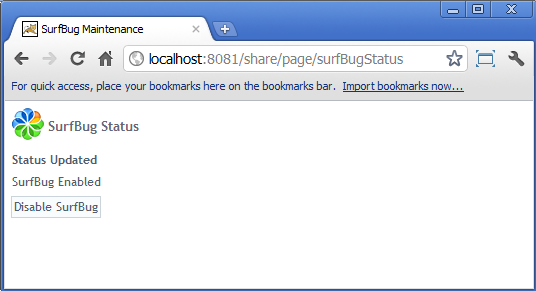
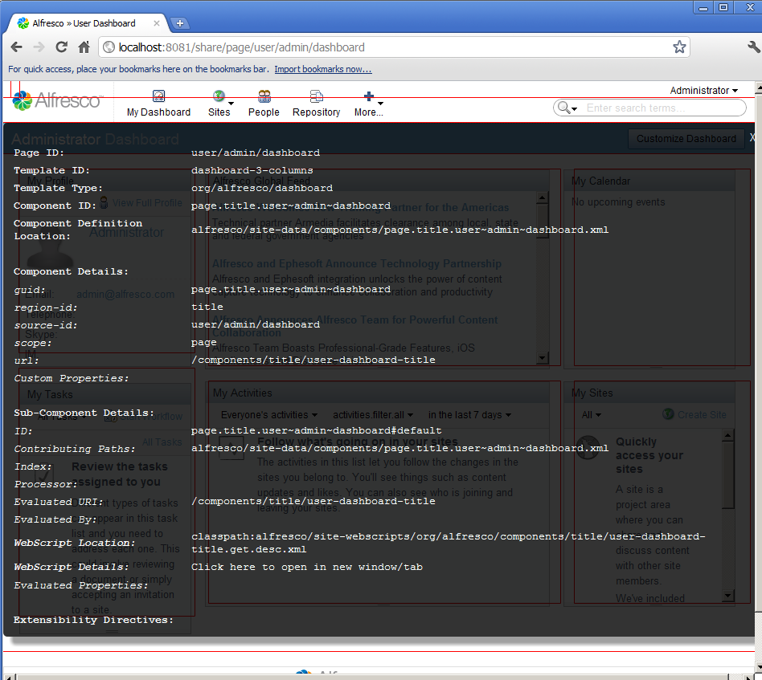

# Introducing SurfBug

This topic provides a brief introduction to SurfBug. SurfBug is a debugging tool built into Spring Surf that displays a variety of information about the various components on a Surf page.If you are not up to speed on Surf see [Spring Surf deep dive](surf-fwork-intro.md).

## Introduction

SurfBug is used to identify the different components that make up a Surf page. For each component it provides a visual indication of location on the page, and information about the component, such as file names, properties, IDs, and sub-component details.

In Alfresco Share you can enable or disable SurfBug through the `SurfBugStatus` webscript. To enable SurfBug and make the tool visible click the **Enable SurfBug** button on the `http://domain:port/share/service/index` page. The status of SurfBug can be subsequently checked or changed at `http://domain:port/share/page/surfBugStatus`. If you are running the Alfresco server locally, and are using the default port for Tomcat servers, then the URL would be `http://localhost:8080/share/page/surfBugStatus`.

Enabling SurfBug and refreshing a page will overlay red boxes on the screen indicating the location of the Components or Sub-Components on the page. When the mouse cursor hovers over a component, the red highlight will change to green to show the currently selected component. The information shown for a component is based upon the Surf application configuration – if the Component interfaces are being fulfilled by the `org.springframework.extension.surf.type.AdvancedComponentImpl` class \(which is the default\) then Sub-Component information will be shown. When you click on a highlighted area, a pop up will be displayed that provides information about the Sub-Component.

SurfBug is not guaranteed to show every Sub-Component on the page if the DOM elements for that page have been manipulated in certain ways. For example, you will not see highlights for the Sub-Components that make the pop up panels for site creation, file upload, and so on. Since the highlights are absolutely positioned on the page \(to avoid affecting the DOM structure\) they are not guaranteed to be in pixel perfect position. However, the approximate position of a highlight and the information contained in its pop up will provide enough information for most needs.

You should not attempt to drive an application's user interface with SurfBug enabled. To avoid doing this, first navigate to the page of interest, then toggle SurfBug on from another tab in your browser. At this point you can refresh the application page and SurfBug highlights will then be displayed. If you need to navigate to another page, disable SurfBug, reload the page to switch off highlights, navigate to the new page of interest, and then re-enable SurfBug.

Note that SurfBug is enabled for the entire application, not just for the user who enables it. SurfBug is intended to be used in development, not production. It requires administrative privileges to invoke, so regular users will not be able to switch it on, but if it gets enabled then every user will see the highlights until it is disabled.

## Information Provided

The following table provides a breakdown of the information that SurfBug provides:

|Page ID|The ID of the Page being displayed|
|Template ID|The ID of the Template being displayed|
|Template Type|Typically this is the path of the FreeMarker template used to render the Alfresco Surf Template referenced by the Page.|
|Component ID|The ID of the Component that the Sub-Component belongs to.|
|Component Definition Location|The runtime path of the file containing the configuration for the Component|
|**Component Details**|
|GUID|Generated unique id of the component|
|Region-id|The id of the region the template into which the component has been bound|
|Source-id|The id of the object at which the component is defined \(this will typically be a Page id, a Template id or will be “global”\)|
|Scope|The scope at which the Component has been defined \(this will typically be "global", "page" or "template"\).|
|URL|URL of the component|
|Custom Properties|Any custom properties that have been configured for the component. These are not used by Alfresco Surf to perform any rendering, but may be used by the Component itself if it is parameterized in any way \(this may be the case for Components backed by JSPs, WebScripts or FreeMarker\).|
|Height|Height of the component in pixels|
|Sub-Component Details|
|ID|The id of the Sub-Component – this is always prefixed by the parent Component id and a "\#" indicates the start of Sub-Component's identification|
|Contributing Paths|The runtime paths of all the files that have provided input into this Sub-Component \(a Sub-Components property, index and evaluation configuration can all be updated by zero or more extension modules\). If no extensions have been applied then this will only contain a single path.|
|Index|The specifically set index of the Sub-Component within the Component. This is the final index after all extensions have been applied. If nothing is shown it means that the default is being used.|
|Processor|The processor that has been used to render the Sub-Component. If this Sub-Component has been generated from legacy configuration then this could be either WebScript, WebTemplate or JSP \(or some custom processor\) – but AdvancedComponents only currently support WebScript processors and if the Sub-Component is not legacy generated then this will be blank.|
|Evaluated URI|The URI used to render the Sub-Component. This is the URI that is generated as a result of processing all Evaluations across all extensions – so is not necessarily the value configured in the source configuration file.|
|Evaluated By|This is the id of the first successful Evaluation and therefore the one that returned the “Evaluated URI” field. If this is blank it means that no Evaluations were performed on the Sub-Component.|
|WebScript Location|If the Sub-Component was rendered by a WebScript then this will show the runtime path of the WebScript descriptor file. The other WebScript files \(template, controller, etc\) will be co-located.|
|WebScript Details|This provides a link to the WebScript information which will be opened in a new tab/window.|
|Evaluated Properties|The properties for the Sub-Component as returned by a successful Evaluation. Properties can be overridden by Evaluations to change how a Sub-Component is rendered.|
|Extensibility Directives|A list of the extensibility directives that have been applied to the Sub-Component.|

**Parent topic:**[Useful Tools](../concepts/dev-extensions-share-useful-tools.md)

